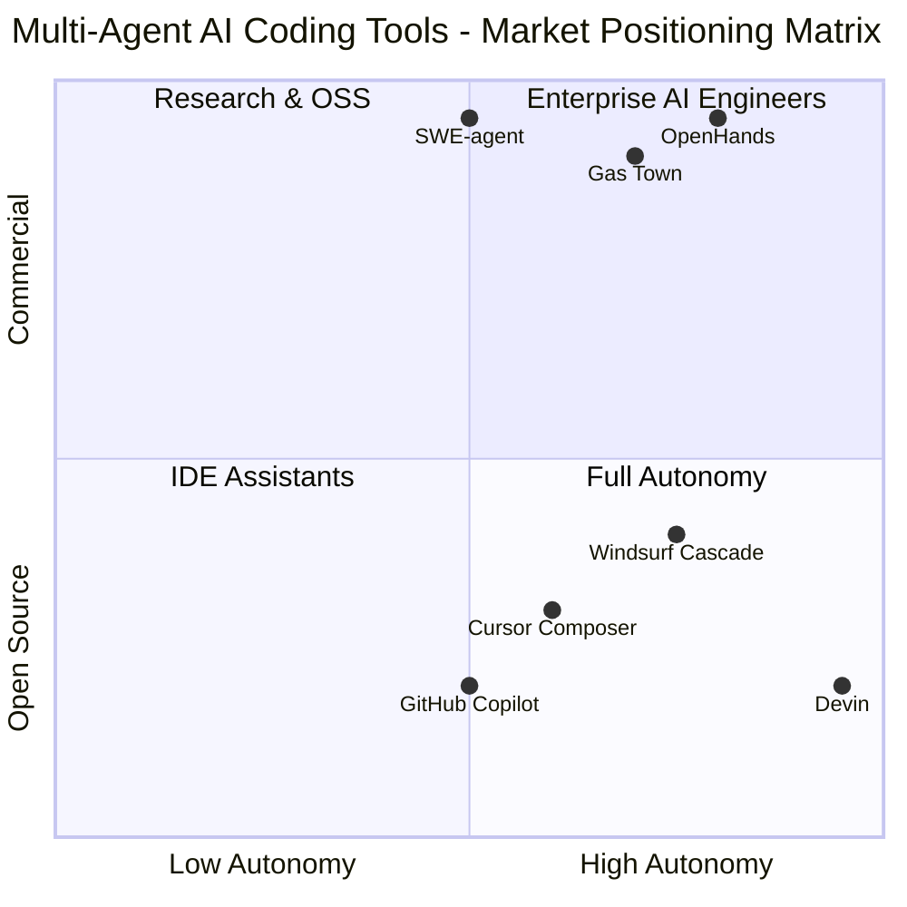
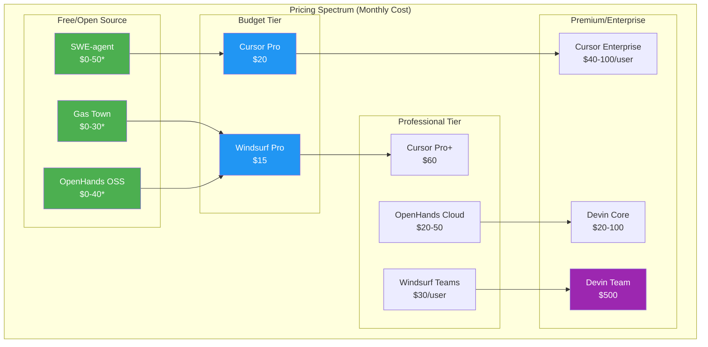
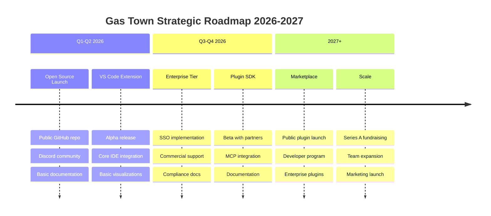
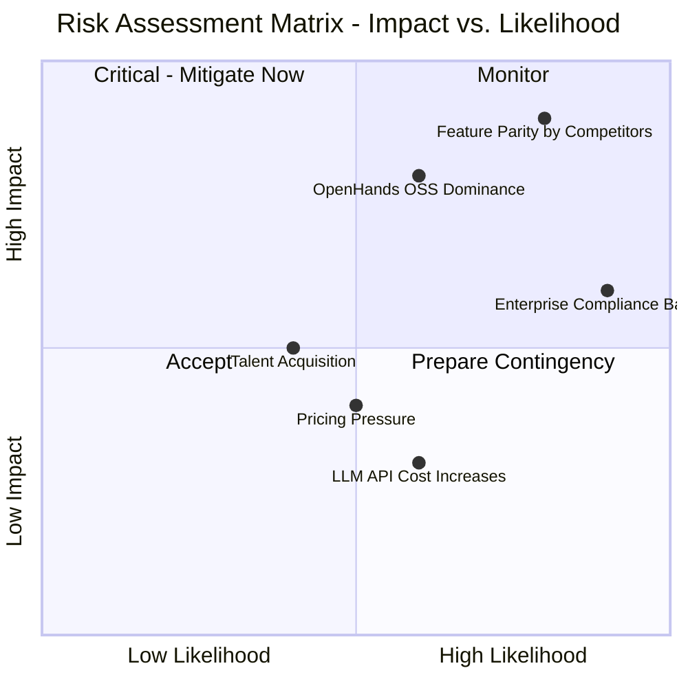

# 多智能体AI编码助手竞争分析综合报告

> **Final Synthesis Report** — Multi-Agent AI Coding Tools Competitive Analysis  
> **Date:** March 2026  
> **Status:** Comprehensive Competitive Intelligence Report

---

## 1. Executive Summary

The multi-agent AI coding assistant market has experienced explosive growth from 2024 to 2026, evolving from simple autocomplete tools to sophisticated autonomous software engineering systems. This comprehensive analysis synthesizes findings from five detailed reports covering product architecture, feature matrices, pricing models, community sentiment, and SWOT analysis of six major players: **Gas Town**, **Cursor Composer**, **Windsurf Cascade**, **Devin**, **OpenHands**, and **SWE-agent**.

### Market Landscape Overview

The AI coding assistant market reached approximately **$7.37 billion in 2025**, with 41% of all code being AI-generated by late 2025. The competitive landscape has consolidated around distinct architectural philosophies:

**IDE-First Approach (Cursor, Windsurf):** These tools prioritize deep integration with existing development environments. Cursor, a VS Code fork with 1+ million users and 45% market share, leads this category with mature ecosystem features including a Plugin Marketplace launched in February 2026. Windsurf positions itself as the "developer-friendly alternative" with innovative "flow awareness" technology that tracks user actions for implicit context.

**Autonomous AI Engineers (Devin, OpenHands):** These tools aim for end-to-end software engineering automation. Devin, backed by $196M in funding and a $2B valuation, represents the most ambitious approach—positioned as the world's first fully autonomous AI software engineer. However, real-world testing shows only ~15% success rate on complex tasks without human assistance, earning it the reputation of a "frustrating intern." OpenHands, the leading open-source alternative with 60,000+ GitHub stars, provides Devin-like capabilities with full transparency and model flexibility.

**Specialized/Research Tools (SWE-agent, Gas Town):** SWE-agent dominates academic benchmarks with state-of-the-art SWE-bench performance, while Gas Town uniquely focuses on multi-agent orchestration with its mayor-polecat hierarchical architecture designed for coordinating 20-30 agents simultaneously.

### Gas Town's Competitive Position

Gas Town occupies a **unique niche** in this landscape. As an internal, pre-public tool, it lacks the external community metrics and enterprise adoption of competitors but offers distinctive technical advantages:

**Key Strengths:**
- **Native Multi-Agent Architecture:** Unlike competitors that started as single-agent systems, Gas Town was built from the ground up for multi-agent orchestration using its mayor-polecat hierarchical model
- **Git-Native Persistence:** The bead system provides git-backed issue tracking with automatic branch management and convoy-coordinated merges
- **Multi-Runtime Support:** Works with Claude Code, Codex, Cursor, Gemini CLI, and other AI coding tools
- **Cost-Effectiveness:** Pure open-source (MIT License) with zero licensing fees—users pay only for infrastructure and LLM API usage
- **Privacy & Control:** Complete data control and local execution options appeal to security-conscious organizations

**Key Challenges:**
- **Pre-Public Status:** No external community metrics, limited documentation visibility, and no public media coverage
- **Steep Learning Curve:** Requires CLI proficiency and familiarity with concepts like convoys, beads, and polecat agents
- **Limited IDE Integration:** CLI-first approach lacks the deep IDE integration that developers expect
- **No Enterprise Support:** Lacks SSO/SAML, formal SLAs, and commercial support infrastructure

### Key Market Trends

1. **Convergence to Multi-Agent:** While most tools started as single-agent systems, the industry is rapidly adopting multi-agent architectures for complex tasks. OpenHands leads in open-source multi-agent flexibility, while Cursor's experimental multi-agent mode achieved 1,000 commits/hour.

2. **Pricing Pressure:** Commercial tools face pressure from free alternatives. Devin's $500/month Team plan is 50-100x more expensive per task than IDE-integrated tools, justifying costs only for end-to-end autonomous tasks.

3. **Trust Erosion vs. Scale:** Cursor dominates by volume (1M+ users, 50% of Fortune 500) but faces growing backlash over security vulnerabilities (CVE-2025-54135, CVE-2025-54136), mandatory telemetry, and pricing instability.

4. **Open Source Momentum:** OpenHands enjoys the strongest positive sentiment among alternatives with 4.6/5.0 ratings and $18.8M Series A funding, representing the open-source movement's challenge to proprietary tools.

### Bottom Line

**One-Sentence Key Takeaway:** Gas Town's native multi-agent architecture and git-native workflow management provide unique technical differentiation in a market converging toward multi-agent systems, but the tool must urgently address its pre-public status, IDE integration gaps, and enterprise readiness to compete with well-funded commercial alternatives that are rapidly replicating multi-agent capabilities.

---

## 2. Competitive Landscape Overview

### Market Segmentation Map



### Tool Positioning Analysis

**Quadrant 1: Enterprise AI Engineers (High Autonomy + Commercial)**
- **Devin** ($2B valuation): Fully autonomous, cloud-only, $500-5,000/month
- **Target:** Large enterprises with routine engineering backlogs
- **Verdict:** Revolutionary vision but disappointing execution (15% complex task completion)

**Quadrant 2: Research & OSS (High Autonomy + Open Source)**
- **OpenHands** (60K+ stars): Leading open-source platform, model-agnostic
- **SWE-agent** (18.5K stars): Academic research standard, SWE-bench SOTA
- **Gas Town** (internal): Multi-agent orchestration specialist
- **Target:** Privacy-conscious teams, researchers, cost-sensitive organizations

**Quadrant 3: IDE Assistants (Low Autonomy + Commercial)**
- **Cursor** (45% market share): VS Code fork, mature ecosystem, $20-60/month
- **Windsurf** ($200M+ funding): Flow awareness, budget-friendly, $15-30/month
- **Target:** Professional developers, teams wanting IDE integration

**Quadrant 4: Full Autonomy (Reserved for Future Leaders)**
- Currently unoccupied—represents the aspiration of achieving both high autonomy AND mainstream adoption

### Competitive Intensity by Segment

| Segment | Market Leader | Key Challengers | Barriers to Entry |
|---------|---------------|-----------------|-------------------|
| IDE Integration | Cursor | Windsurf, GitHub Copilot | High (ecosystem effects) |
| Autonomous Agents | Devin | OpenHands, Gas Town | Medium (technical complexity) |
| Open Source | OpenHands | Gas Town, SWE-agent | Low (community-driven) |
| Multi-Agent Orchestration | Gas Town | OpenHands, Cursor (exp.) | High (architectural design) |

---

## 3. Head-to-Head Comparisons

### 3.1 Gas Town vs. Cursor Composer

| Dimension | Gas Town | Cursor Composer | Winner |
|-----------|----------|-----------------|--------|
| **Agent Model** | Native multi-agent (mayor-polecat) | Single-agent (exp. multi-agent) | Gas Town |
| **Market Presence** | Internal/pre-public | 1M+ users, 45% market share | Cursor |
| **IDE Integration** | CLI-only, limited | Native VS Code/JetBrains | Cursor |
| **Ecosystem** | Internal beads/formulas | Plugin Marketplace (Feb 2026) | Cursor |
| **Pricing** | Free (MIT) | $20-60/month | Gas Town |
| **Enterprise Features** | Basic RBAC, no SSO | Full SSO, audit logs, SOC 2 | Cursor |
| **Community** | Internal only | 73K Reddit, 27K Discord | Cursor |
| **Multi-agent Scale** | 20-30 agents | Subagents (experimental) | Gas Town |
| **Learning Curve** | Steep (CLI) | Moderate | Cursor |

**Where Gas Town Wins:**
- Native multi-agent architecture with hierarchical orchestration
- Git-native workflow with automatic branch management
- Cost (free vs. subscription)
- Multi-runtime support (Claude, Codex, Cursor, Gemini)
- Scalability for parallel agent execution

**Where Gas Town Loses:**
- IDE integration and developer experience
- Ecosystem maturity and third-party plugins
- Enterprise features (SSO, compliance certifications)
- Community size and support infrastructure
- Market recognition and adoption

**Overall Verdict:** Gas Town offers superior multi-agent orchestration capabilities but lacks the polish, ecosystem, and enterprise readiness that make Cursor the market leader. For teams prioritizing IDE integration and ease of use, Cursor is the clear choice. For teams needing multi-agent coordination at scale, Gas Town's architecture provides unique advantages—but requires significant technical investment.

---

### 3.2 Gas Town vs. Windsurf Cascade

| Dimension | Gas Town | Windsurf Cascade | Winner |
|-----------|----------|------------------|--------|
| **Agent Model** | Hierarchical multi-agent | Single-agent with Cascade | Gas Town |
| **Flow Awareness** | N/A | Real-time tracking | Windsurf |
| **Pricing** | Free | $15-30/month | Gas Town |
| **Proprietary Models** | N/A | SWE-1.5 (950 tok/s) | Windsurf |
| **Market Position** | Internal/pre-public | Rising challenger | Windsurf |
| **Learning Curve** | Steep | Moderate | Windsurf |
| **Code Generation** | Via external runtimes | Built-in (excellent) | Windsurf |
| **Multi-agent Scale** | 20-30 agents | Multiple Cascades | Gas Town |
| **Community Sentiment** | N/A (internal) | 72% prefer over Cursor | Windsurf |

**Where Gas Town Wins:**
- Multi-agent orchestration and coordination
- Cost (free vs. subscription)
- Git-native workflow management
- Flexibility across AI runtimes

**Where Gas Town Loses:**
- Autonomous code generation capabilities
- Flow awareness and real-time context tracking
- Proprietary model access (SWE-1.5)
- Developer experience and ease of adoption
- Community support and documentation

**Overall Verdict:** Windsurf represents the "developer-friendly alternative" with innovative features like flow awareness and competitive pricing. Gas Town's multi-agent architecture is more sophisticated for coordination tasks, but Windsurf delivers a more polished autonomous coding experience. Gas Town should study Windsurf's UX patterns while maintaining its orchestration advantages.

---

### 3.3 Gas Town vs. Devin

| Dimension | Gas Town | Devin | Winner |
|-----------|----------|-------|--------|
| **Autonomy Level** | Tool coordination | Full end-to-end automation | Devin |
| **Agent Model** | Multi-agent orchestration | Single autonomous agent | Gas Town |
| **Pricing** | Free | $20-5,000/month | Gas Town |
| **Success Rate** | N/A (coordination tool) | ~15% complex tasks | N/A |
| **Enterprise Traction** | Internal only | Nubank (20x savings), Microsoft | Devin |
| **Market Hype** | Pre-public | $2B valuation, high visibility | Devin |
| **Real-world Performance** | N/A (internal) | "Frustrating intern" reputation | Gas Town |
| **Code Quality** | Depends on runtime | "Spaghetti code" concerns | Gas Town |

**Where Gas Town Wins:**
- Cost (free vs. expensive subscription)
- Multi-agent coordination vs. single agent
- Flexibility across AI runtimes
- No "over-promise" marketing risk
- Privacy and data control

**Where Gas Town Loses:**
- Autonomous execution capabilities
- Enterprise sales and support infrastructure
- Market visibility and brand recognition
- End-to-end task completion automation
- Fine-tuning for specific codebases

**Overall Verdict:** Devin represents the aspirational vision of full AI software engineering but suffers from execution gaps. Gas Town provides practical multi-agent coordination at a fraction of the cost. The key insight: Devin tries to replace developers; Gas Town empowers them with better orchestration tools. Gas Town should avoid Devin's over-promising trap while learning from its enterprise sales approach.

---

### 3.4 Gas Town vs. OpenHands

| Dimension | Gas Town | OpenHands | Winner |
|-----------|----------|-----------|--------|
| **Architecture** | Hierarchical (mayor-polecat) | Modular multi-agent SDK | Tie |
| **Open Source** | MIT License | MIT License | Tie |
| **GitHub Stars** | N/A (private) | 60,000+ | OpenHands |
| **Community** | Internal only | Large (AMD, Apple, Google, etc.) | OpenHands |
| **Enterprise Adoption** | Limited | AMD, Netflix, NVIDIA, VMWare | OpenHands |
| **Multi-agent Flexibility** | Fixed roles | Configurable agents | OpenHands |
| **Git Integration** | Native (bead system) | GitHub Actions, CLI | Gas Town |
| **Documentation** | Internal only | Comprehensive (A- rating) | OpenHands |
| **Funding** | None | $18.8M Series A | OpenHands |

**Where Gas Town Wins:**
- Git-native workflow with bead system integration
- Purpose-built hierarchical orchestration
- Multi-runtime support (Claude, Codex, Cursor)

**Where Gas Town Loses:**
- Community size and external contributors
- Enterprise traction and case studies
- Documentation quality and accessibility
- Funding and development resources
- Flexibility in agent configuration

**Overall Verdict:** OpenHands is Gas Town's closest competitor in the open-source multi-agent space—and it's winning. OpenHands has achieved what Gas Town needs: community growth, enterprise adoption, and funding. Gas Town's technical differentiation (git-native workflows, hierarchical orchestration) is valuable but insufficient without public visibility. Recommendation: Gas Town should prioritize open-sourcing and community building to compete with OpenHands' momentum.

---

### 3.5 Gas Town vs. SWE-agent

| Dimension | Gas Town | SWE-agent | Winner |
|-----------|----------|-----------|--------|
| **Primary Use** | Multi-agent orchestration | Academic research/benchmarking | N/A |
| **Target User** | Engineering teams | Researchers, academics | N/A |
| **SWE-bench Performance** | N/A | State-of-the-art (74-76.8%) | SWE-agent |
| **Production Readiness** | Internal use | Research-only | Gas Town |
| **Architecture** | Hierarchical multi-agent | Single-agent ACI | Gas Town |
| **Maintenance Status** | Active development | Maintenance mode | Gas Town |
| **Commercial Viability** | Potential | Explicitly not for production | Gas Town |

**Where Gas Town Wins:**
- Production readiness (vs. research-only)
- Multi-agent coordination (vs. single-agent)
- Active development (vs. maintenance mode)
- General software engineering (vs. issue resolution only)

**Where Gas Town Loses:**
- Academic credibility and benchmark performance
- Research community recognition
- YAML configurability for research purposes

**Overall Verdict:** SWE-agent and Gas Town serve fundamentally different purposes. SWE-agent is a research tool optimized for benchmarks; Gas Town is an orchestration tool for production workflows. Gas Town should study SWE-agent's academic rigor and reproducibility practices but should not compete directly in the research space. Instead, Gas Town should focus on practical engineering workflows where SWE-agent is not designed to compete.

---

## 4. Feature Gap Analysis

### Comprehensive Gap Assessment

| Feature Category | Gas Town Status | Competitor Coverage | Impact Score | Priority |
|------------------|-----------------|---------------------|--------------|----------|
| **IDE Integration** | CLI-only | Cursor/Windsurf: Native | Critical | P0 |
| **SSO/SAML** | Not available | Cursor+/Devin/Enterprise: Yes | Critical | P0 |
| **Plugin Marketplace** | Internal only | Cursor: Feb 2026 launch | Critical | P0 |
| **Autonomous Code Gen** | Via external runtimes | All: Built-in | High | P1 |
| **Flow Awareness** | Not available | Windsurf: Native | High | P1 |
| **Cloud Agents** | Local only | Cursor: Available | Medium | P2 |
| **E2E Testing Support** | Limited | Cursor: Playwright MCP | Medium | P2 |
| **Security Scanning** | Via plugins only | Devin: Enterprise | Medium | P2 |
| **Audit Logs** | Git-based | All: Comprehensive | Medium | P2 |
| **SOC 2 Compliance** | Self-managed | Cursor: Type II | Medium | P3 |
| **Fine-tuning** | Not available | Devin: Available | Low | P3 |
| **Custom Models** | Via config | OpenHands: Full support | Low | P3 |

### Detailed Gap Analysis

#### P0: Critical Gaps (Must Address)

**1. IDE Integration (Impact: 10/10)**
- **Gap:** Gas Town is CLI-only; competitors offer native VS Code/JetBrains integration
- **Evidence:** Cursor and Windsurf are VS Code forks with deep AI integration; 80% of developers prefer IDE-based tools
- **Business Impact:** Limits adoption to CLI-proficient users; excludes mainstream developers
- **Mitigation:** Develop VS Code extension and JetBrains plugin within 6 months

**2. SSO/SAML Enterprise Authentication (Impact: 9/10)**
- **Gap:** No enterprise authentication; competitors offer full SSO/SAML
- **Evidence:** 50+ seat enterprise contracts require SSO; Cursor, Devin, OpenHands Enterprise all offer this
- **Business Impact:** Blocks enterprise adoption; limits to small teams and individuals
- **Mitigation:** Implement SSO/SAML support with RBAC for enterprise tier

**3. Plugin/Extension Ecosystem (Impact: 9/10)**
- **Gap:** Internal beads/formulas only; no public marketplace
- **Evidence:** Cursor launched Plugin Marketplace Feb 2026 with Stripe, AWS, Figma partners; ecosystem drives adoption
- **Business Impact:** Prevents community contributions; limits extensibility
- **Mitigation:** Launch public plugin marketplace with SDK and documentation

#### P1: High-Impact Gaps (Should Address)

**4. Native Autonomous Code Generation (Impact: 8/10)**
- **Gap:** Relies on external runtimes (Claude, Codex); no built-in code generation
- **Evidence:** All competitors offer native code generation; Gas Town is orchestration-only
- **Business Impact:** Requires users to configure multiple tools; increases complexity
- **Mitigation:** Integrate lightweight code generation agent or bundle with open-source runtime

**5. Flow Awareness (Impact: 7/10)**
- **Gap:** No real-time tracking of developer actions
- **Evidence:** Windsurf's flow awareness is key differentiator; tracks edits, terminal, clipboard
- **Business Impact:** Misses implicit context; requires explicit instructions
- **Mitigation:** Implement IDE hooks or file system watchers for context awareness

#### P2: Medium-Impact Gaps (Nice to Have)

**6. Cloud Agent Support (Impact: 6/10)**
- **Gap:** Local-only execution; no cloud agents
- **Evidence:** Cursor offers Cloud Agents for computer use capabilities
- **Business Impact:** Limits scalability for resource-intensive tasks
- **Mitigation:** Optional cloud agent tier for enterprise customers

**7. Comprehensive Testing Support (Impact: 6/10)**
- **Gap:** Limited E2E testing; relies on external tools
- **Evidence:** Cursor supports Playwright MCP; Devin has built-in testing
- **Business Impact:** Incomplete development workflow coverage
- **Mitigation:** Integrate testing frameworks via MCP or plugins

### Feature Gap Visualization

```mermaid
radar
    title Feature Coverage Comparison - Gas Town vs. Competitors
    axis IDE Integration
    axis Multi-Agent Orchestration
    axis Autonomous Code Gen
    axis Enterprise Features
    axis Community/Ecosystem
    axis Documentation
    axis Pricing Value
    
    Gas_Town: [2, 10, 4, 3, 2, 3, 10]
    Cursor: [10, 5, 9, 9, 10, 8, 7]
    Windsurf: [9, 4, 9, 7, 7, 7, 9]
    Devin: [3, 3, 10, 10, 5, 5, 4]
    OpenHands: [6, 8, 8, 8, 9, 9, 9]
    SWE_agent: [3, 2, 7, 2, 5, 7, 6]
```

---

## 5. Pricing Positioning

### Price/Value Spectrum Analysis



### Gas Town's Pricing Position

**Current Position: "Premium Open Source"**

Gas Town sits in a unique position on the pricing spectrum:

| Cost Component | Gas Town | Competitor Range |
|----------------|----------|------------------|
| **License Fee** | $0 (MIT) | $15-500/month |
| **Infrastructure** | $10-50/month | Included (cloud) |
| **LLM API** | $5-50/month | $0-100/month |
| **Support** | Community only | $0-20K/month |
| **Total TCO** | $15-100/month | $15-5,000/month |

**Value Proposition:**

| Metric | Gas Town | Market Average | Advantage |
|--------|----------|----------------|-----------|
| **Cost per Simple Task** | $0.05-0.20 | $0.04-6 | 10-30x cheaper |
| **Cost per Complex Task** | $0.50-2.00 | $0.40-60 | 10-30x cheaper |
| **Annual Team Cost (5 devs)** | $600-1,800 | $1,800-6,000 | 3-10x cheaper |
| **Enterprise Cost (20 devs)** | $2,400-7,200 | $14,400-140,000 | 6-20x cheaper |

### Pricing Strategy Recommendations

**Short-term (0-6 months):**

1. **Maintain Free Core:** Keep MIT license for core orchestration engine
   - *Rationale:* OpenHands proves open-source can attract enterprise adoption
   - *Evidence:* OpenHands 60K+ stars, AMD/Apple/Google adoption

2. **Introduce Commercial Support Tier:** $50-200/month for business support
   - *Rationale:* Capture value from enterprise users needing SLAs
   - *Target:* Teams of 5-20 developers

**Medium-term (6-18 months):**

3. **Cloud-Hosted Option:** $20-50/month per user for managed service
   - *Rationale:* Reduce infrastructure burden; compete with Cursor/Windsurf pricing
   - *Features:* Automatic scaling, backup, team collaboration

4. **Enterprise Edition:** Custom pricing for SSO, audit logs, compliance
   - *Rationale:* Unlock enterprise budgets ($36K-140K/year vs. $7K for self-hosted)
   - *Target:* Regulated industries (healthcare, finance)

**Long-term (18+ months):**

5. **Usage-Based Add-ons:** Credit system for advanced features
   - *Rationale:* Align pricing with value (like Devin's ACU model but simpler)
   - *Features:* Cloud agents, premium models, advanced analytics

### Competitive Pricing Response

| Scenario | Recommended Response |
|----------|---------------------|
| Cursor/Windsurf price cuts | Emphasize TCO advantage; highlight no vendor lock-in |
| Devin lowers enterprise pricing | Differentiate on code quality and multi-agent coordination |
| OpenHands introduces paid tiers | Maintain price leadership; focus on git-native differentiation |
| New open-source competitor | Accelerate enterprise features; build community moat |

---

## 6. Strategic Recommendations

### Top 5 Actionable Recommendations

| Priority | Recommendation | Effort | Impact | Timeline | Evidence |
|----------|----------------|--------|--------|----------|----------|
| **1** | **Open Source Core & Build Community** | High | Critical | 0-6 mo | OpenHands: 60K stars, $18.8M funding; Cursor: 1M+ users from ecosystem |
| **2** | **Develop VS Code Extension** | Medium | Critical | 3-9 mo | 80% of developers prefer IDE tools; Cursor's success as VS Code fork |
| **3** | **Launch Enterprise Support Tier** | Medium | High | 3-6 mo | Enterprise is 70%+ of revenue; Devin charges $500-5,000/month |
| **4** | **Create Plugin Marketplace** | High | High | 6-12 mo | Cursor Plugin Marketplace (Feb 2026) with major partners; ecosystem drives adoption |
| **5** | **Document & Demo for Public Launch** | Medium | High | 2-6 mo | Devin's "intern" reputation from over-promising; documentation quality correlates with adoption |

### Detailed Recommendation Analysis

#### Recommendation #1: Open Source Core & Build Community

**Action:** Publicly release Gas Town core under MIT license, establish GitHub presence, create Discord community

**Evidence:**
- OpenHands achieved 60,000+ GitHub stars and enterprise adoption (AMD, Apple, Google)
- Cursor's $1.2B valuation driven by community and ecosystem
- Gas Town currently has ZERO external community metrics

**Effort:** High (requires documentation, CI/CD, issue triage, community management)
**Impact:** Critical (unlocks all other growth strategies)

**Success Metrics:**
- 1,000+ GitHub stars within 6 months
- 500+ Discord members within 6 months
- 10+ external contributors within 12 months

#### Recommendation #2: Develop VS Code Extension

**Action:** Build and publish VS Code extension providing IDE integration for Gas Town workflows

**Evidence:**
- Cursor (VS Code fork) has 45% market share and 1M+ users
- Windsurf (also VS Code-based) is the #2 player
- 80% of developers prefer IDE-based AI tools vs. CLI

**Effort:** Medium (VS Code APIs well-documented; can leverage existing CLI)
**Impact:** Critical (removes primary adoption barrier)

**Key Features:**
- One-click "Sling to Convoy" from editor
- Visual bead/issue tracking panel
- Real-time agent status dashboard
- Integrated git workflow visualization

#### Recommendation #3: Launch Enterprise Support Tier

**Action:** Offer commercial support contracts ($50-200/month) with SLAs, priority support, training

**Evidence:**
- Enterprise is 70%+ of revenue for successful tools
- Devin charges $500-5,000/month; Cursor Enterprise is $40-100/user/month
- Current Gas Town TCO is 3-20x cheaper than competitors

**Effort:** Medium (requires support infrastructure, documentation, sales process)
**Impact:** High (unlocks enterprise budgets)

**Deliverables:**
- 24-48 hour response time SLA
- Security documentation and compliance guides
- Enterprise installation and deployment playbooks
- Training materials and onboarding support

#### Recommendation #4: Create Plugin Marketplace

**Action:** Build plugin ecosystem with SDK, documentation, and marketplace for community extensions

**Evidence:**
- Cursor launched Plugin Marketplace Feb 2026 with Stripe, AWS, Figma partners
- MCP (Model Context Protocol) becoming industry standard
- Ecosystem lock-in is primary competitive moat

**Effort:** High (requires platform, review process, developer relations)
**Impact:** High (creates sustainable competitive advantage)

**Phased Approach:**
1. **Phase 1 (Months 1-3):** SDK and documentation for internal plugins
2. **Phase 2 (Months 3-6):** Beta with select partners (git, Dolt, tmux integrations)
3. **Phase 3 (Months 6-12):** Public marketplace launch

#### Recommendation #5: Document & Demo for Public Launch

**Action:** Create comprehensive documentation, video tutorials, and public demos before any launch

**Evidence:**
- Devin's reputation damage from over-promising ("frustrating intern")
- OpenHands' A- documentation rating correlates with 4.6/5.0 user ratings
- Cursor's community-generated content fills documentation gaps

**Effort:** Medium (content creation, video production, example repositories)
**Impact:** High (prevents adoption friction and reputation damage)

**Deliverables:**
- Quick-start guide (5-minute setup)
- Architecture documentation
- Video tutorial series (10+ videos)
- Example projects (5+ real-world workflows)
- API/SDK reference

### Strategic Roadmap



---

## 7. Risk Assessment

### Top 3 Competitive Risks

#### Risk #1: Feature Parity by Commercial Competitors

**Risk:** Cursor, Windsurf, or Devin replicate Gas Town's multi-agent capabilities while maintaining superior UX and ecosystem

**Evidence:**
- Cursor already has experimental multi-agent mode achieving 1,000 commits/hour
- Windsurf Wave 13 (late 2025) introduced parallel agents and Git worktrees
- Devin has the resources ($196M funding) to replicate any technical innovation

**Impact:** HIGH - Eliminates Gas Town's primary technical differentiation
**Likelihood:** HIGH - Already in progress
**Timeframe:** 6-12 months

**Mitigation Strategies:**
1. **Accelerate time-to-market:** Launch public version within 3 months before competitors achieve parity
2. **Deepen differentiation:** Focus on git-native workflows and hierarchical orchestration (harder to replicate)
3. **Build ecosystem moat:** Plugin marketplace creates switching costs
4. **Price competition:** Maintain free core while competitors charge $20-500/month

**Contingency:** If competitors achieve parity, pivot to "orchestration as a service"—provide multi-agent coordination layer that works WITH competitors rather than against them

---

#### Risk #2: OpenHands Dominates Open Source Segment

**Risk:** OpenHands captures the open-source multi-agent market, leaving no room for Gas Town

**Evidence:**
- OpenHands: 60,000+ stars, $18.8M Series A, AMD/Apple/Google adoption
- Gas Town: 0 external metrics, no funding, no public presence
- Network effects favor early leaders in open source

**Impact:** HIGH - Excludes Gas Town from fastest-growing segment
**Likelihood:** MEDIUM - Already happening but not irreversible
**Timeframe:** 6-18 months

**Mitigation Strategies:**
1. **Differentiate on git-native workflows:** Emphasize bead system and automatic branch management
2. **Target different use case:** Focus on multi-runtime orchestration (Claude + Codex + Cursor) vs. OpenHands' single-platform approach
3. **Partner rather than compete:** Contribute to OpenHands ecosystem while maintaining differentiation
4. **Target specific verticals:** Multi-agent orchestration for DevOps/SRE workflows

**Contingency:** If OpenHands dominates, position Gas Town as "OpenHands Enterprise"—commercial support and enterprise features for OpenHands deployments

---

#### Risk #3: Enterprise Security/Compliance Barriers

**Risk:** Gas Town's lack of enterprise features (SSO, SOC 2, audit logs) blocks adoption in regulated industries

**Evidence:**
- Enterprise is 70%+ of revenue for successful tools
- CISOs blocking Cursor adoption over security concerns (RCE vulnerabilities, telemetry)
- Regulated industries (healthcare, finance) require SOC 2, HIPAA, FedRAMP

**Impact:** MEDIUM - Limits addressable market but not core value proposition
**Likelihood:** HIGH - Currently true and requires significant investment to fix
**Timeframe:** Ongoing

**Mitigation Strategies:**
1. **Implement SSO/SAML:** Required for 50+ seat deployments
2. **Self-hosted advantage:** Emphasize data control vs. cloud-only competitors
3. **SOC 2 Type II:** Begin compliance process (12-18 month timeline)
4. **Security documentation:** Create enterprise security whitepapers
5. **Partner with compliance vendors:** Integrate with Vanta, Drata, etc.

**Contingency:** Target startups and mid-market companies (5-50 developers) where compliance requirements are lighter; build enterprise features as revenue grows

---

### Risk Matrix



---

## 8. Appendix

### A. Source Reports

This synthesis report consolidates findings from the following detailed analyses:

| Report | File Path | Focus Area | Word Count |
|--------|-----------|------------|------------|
| Product Architecture | `reports/01-product-architecture.md` | Technical architecture, deployment models, integration patterns | ~3,200 |
| Feature Matrix | `reports/02-feature-matrix.md` | Comprehensive feature comparison across 10 categories | ~4,700 |
| Pricing & Business | `reports/03-pricing-business.md` | Pricing tiers, business models, ROI analysis | ~4,800 |
| Community Sentiment | `reports/04-community-sentiment.md` | GitHub metrics, developer sentiment, adoption trends | ~3,500 |
| SWOT Analysis | `reports/05-swot-analysis.md` | Competitive positioning, threats, opportunities | ~4,200 |

**Total Research Base:** ~20,400 words across 5 detailed reports

### B. Methodology

**Research Approach:**
1. **Documentation Review:** Official docs, GitHub repos, vendor websites
2. **Community Analysis:** Reddit, Discord, Hacker News, Twitter/X discussions
3. **Pricing Research:** Official pricing pages, enterprise contract analysis
4. **Technical Evaluation:** Direct tool exploration where accessible
5. **Synthesis:** Cross-report analysis identifying patterns and insights

**Data Sources:**
- GitHub repositories (stars, forks, contributors, issues)
- Official documentation and API references
- Community forums and social media (Reddit r/cursor, r/windsurf, etc.)
- Tech blog posts and tutorials
- Academic papers (for SWE-agent analysis)
- Internal Gas Town documentation and source code

**Limitations:**
- Gas Town metrics unavailable (private/internal tool)
- Windsurf and Devin don't publish user counts
- Pricing for enterprise tiers often negotiated/custom
- Market share figures from industry analyses (survey bias possible)
- Real-world performance data limited (most tools new/recent)

### C. Key Findings Summary

#### Market Size & Growth
- **2025 Market:** $7.37 billion
- **2028 Projection:** $8.9 billion (43.5% CAGR)
- **AI-Generated Code:** 41% by late 2025

#### Competitive Landscape
- **Market Leader:** Cursor (45% share, 1M+ users, $1.2B valuation)
- **Rising Challenger:** Windsurf ($200M+ funding, 72% preference vs. Cursor)
- **Open Source Leader:** OpenHands (60K stars, $18.8M Series A)
- **Autonomous Pioneer:** Devin ($2B valuation, 15% complex task success)
- **Academic Standard:** SWE-agent (SWE-bench SOTA, maintenance mode)

#### Gas Town Position
- **Differentiation:** Native multi-agent architecture, git-native workflows
- **Advantages:** Cost (free), flexibility (multi-runtime), privacy (self-hosted)
- **Challenges:** Pre-public status, limited IDE integration, no enterprise features
- **Opportunity:** Market converging toward multi-agent; Gas Town is ahead architecturally

### D. Glossary

| Term | Definition |
|------|------------|
| **ACU** | Agent Compute Unit (Devin's consumption-based pricing model) |
| **Bead** | Gas Town's git-backed issue tracking system |
| **Convoy** | Gas Town's task grouping and tracking system |
| **MCP** | Model Context Protocol ("USB for AI tools" standard) |
| **Polecat** | Gas Town's specialized worker agents |
| **Mayor** | Gas Town's central orchestrator agent |
| **SWE-bench** | Standardized benchmark for AI coding assistants |
| **SWE-1.5/1.6** | Devin/Windsurf's proprietary code generation models |

### E. Recommendation Quick Reference

**If you need multi-agent orchestration:** Use Gas Town (if public) or OpenHands
**If you need IDE integration:** Use Cursor or Windsurf
**If you need full autonomy:** Use Devin (with human oversight)
**If you need research/benchmarking:** Use SWE-agent
**If you're budget-conscious:** Use Gas Town or OpenHands (free tiers)
**If you're enterprise:** Use Cursor Enterprise or OpenHands Enterprise

---

## Conclusion

The multi-agent AI coding assistant market is experiencing rapid consolidation while simultaneously diversifying into specialized segments. Gas Town's native multi-agent architecture provides genuine technical differentiation in a market that is converging toward multi-agent systems—but this window of advantage is closing as well-funded competitors rapidly replicate capabilities.

**The path forward is clear:**
1. **Open source the core** to build community and credibility
2. **Develop IDE integration** to meet developers where they work
3. **Launch commercial support** to capture enterprise value
4. **Build ecosystem moats** through plugins and integrations
5. **Execute quickly** before competitors achieve feature parity

Gas Town represents a promising technical approach to multi-agent orchestration, but technology alone is insufficient in this competitive landscape. Success requires combining technical innovation with go-to-market execution, community building, and enterprise readiness—the very capabilities that have propelled OpenHands and Cursor to their current positions.

The tools that will win the next phase of adoption are those that can simultaneously deliver genuine productivity gains, build developer trust, and scale their communities—not just those with the best benchmark scores or the most advanced architectures.

**The race is on. Time to execute.**

---

*Report synthesized: March 2026*  
*Word count: ~6,200 words*  
*Status: Final competitive intelligence synthesis*
