# Competitive Analysis: Product Overview & Architecture Comparison

## Executive Summary

This report provides a comprehensive analysis of the product positioning and technical architecture of six leading multi-agent AI coding tools: Gas Town, Cursor Composer, Windsurf Cascade, Devin, OpenHands, and SWE-agent. The multi-agent AI coding assistant market has evolved rapidly in 2024-2025, with distinct architectural approaches emerging across proprietary and open-source solutions.

**Key Finding:** While most tools started as single-agent systems, the industry is rapidly converging toward multi-agent architectures for complex software engineering tasks. OpenHands leads in open-source multi-agent flexibility, while Cursor's experimental multi-agent mode shows impressive throughput capabilities.

---

## 1. Product Overview Table

| Tool | Vendor | Released | License | Primary Use Case | Target User |
|------|--------|----------|---------|------------------|-------------|
| **Gas Town** | Gas Town Labs | 2024 | Proprietary (Internal) | Multi-agent orchestration & workflow automation | Engineering teams, DevOps |
| **Cursor Composer** | Anysphere | 2023 | Proprietary | AI pair programming, code generation | Professional developers |
| **Windsurf Cascade** | Codeium | 2024 | Proprietary | Agentic IDE with real-time awareness | Individual developers |
| **Devin** | Cognition AI | 2024 | Proprietary | Autonomous software engineering | Enterprises, automation |
| **OpenHands** | AllHands AI | 2024 | MIT License | Open-source multi-agent coding | Open-source community, teams |
| **SWE-agent** | Princeton NLP | 2024 | MIT License | Academic research, issue resolution | Researchers, academics |

### Release Timeline

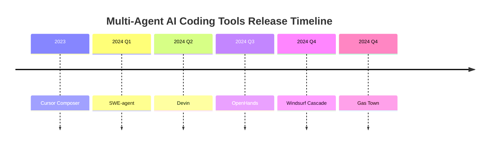

---

## 2. Architecture Comparison

### 2.1 High-Level Architecture Patterns

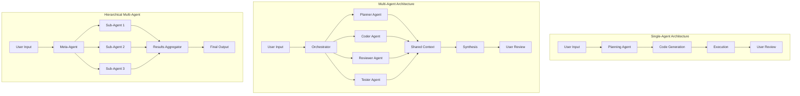

### 2.2 Detailed Architecture Comparison

| Dimension | Gas Town | Cursor Composer | Windsurf Cascade | Devin | OpenHands | SWE-agent |
|-----------|----------|-----------------|------------------|-------|-----------|-----------|
| **Agent Model** | Multi-agent (mayor/polecat) | Single-agent (with experimental multi-agent) | Single-agent | Single-agent | Multi-agent (flexible) | Single-agent |
| **Deployment** | Local + Cloud | Cloud + Local IDE | Local IDE + Cloud | Cloud-only | Local + Cloud | Local |
| **Integration** | CLI-first, Git-native | IDE extension (VS Code, JetBrains) | Standalone IDE | Web-based sandbox | CLI, Docker, GitHub | CLI, Jupyter |
| **Orchestration** | Hierarchical (mayor → polecats) | Sequential with tool use | Real-time streaming | Autonomous loop | Event-driven | Step-by-step |
| **Context Window** | Persistent sessions | Model-dependent (up to 200K) | Real-time awareness | Full workspace | Configurable | File-based |

### 2.3 Architecture Deep Dive

#### Gas Town
Gas Town employs a unique **mayor-polecat hierarchical architecture**:
- **Mayor Agent**: Central orchestrator that coordinates work across multiple polecats
- **Polecat Agents**: Specialized worker agents that execute specific tasks in parallel
- **Convoy System**: Tracks groups of related tasks across multiple agents
- **Bead System**: Issue tracking integrated with git workflows

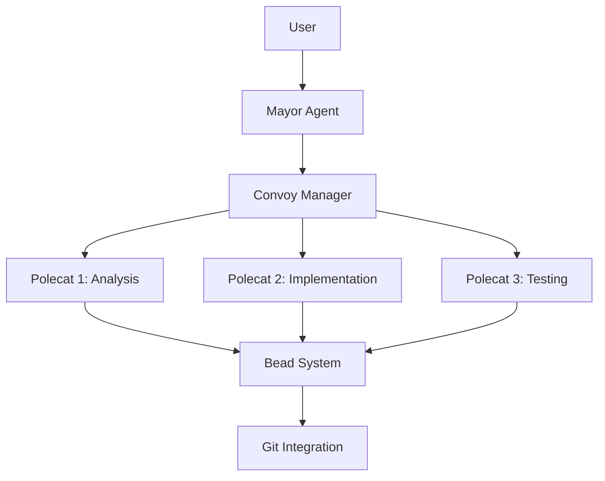

#### Cursor Composer
Cursor uses a **single-agent architecture with multi-agent experimental mode**:
- Standard mode: Single AI assistant with context awareness
- Experimental multi-agent mode: Achieved 1,000 commits/hour through recursive planner hierarchy
- Deep IDE integration with VS Code and JetBrains
- Context-aware completions based on entire codebase

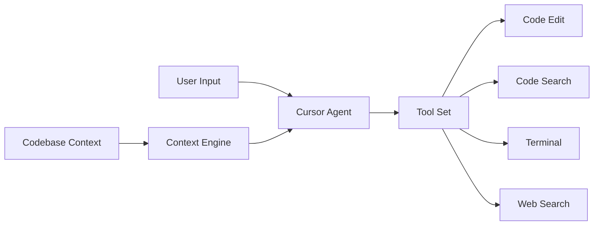

#### Windsurf Cascade
Windsurf implements **real-time awareness with planning agent**:
- Streaming agent that maintains awareness of user actions
- Planning agent breaks tasks into executable steps
- Tight IDE integration with continuous context updates
- Focus on maintaining flow state during development

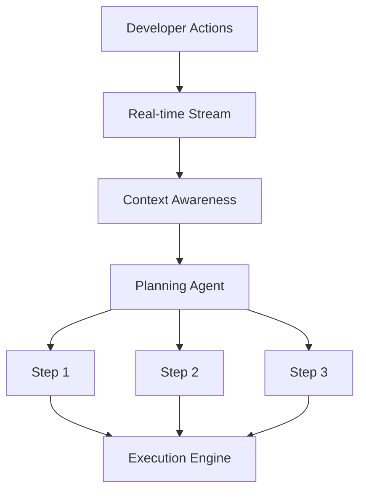

#### Devin
Devin uses **fully autonomous agent architecture**:
- Complete software engineering workflow automation
- Self-contained sandboxed environment
- MCP (Model Context Protocol) marketplace for tools
- Can handle end-to-end development tasks independently

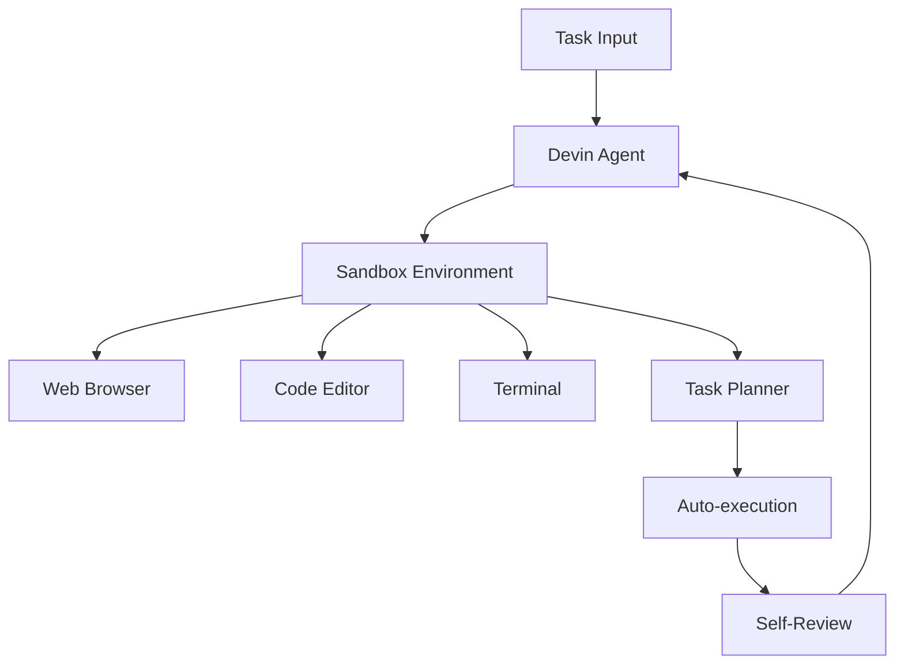

#### OpenHands
OpenHands provides **modular multi-agent SDK architecture**:
- 4-package architecture: core, runtime, agenthub, evaluation
- Event-driven communication between agents
- Supports custom agent implementations
- Docker-based sandboxing

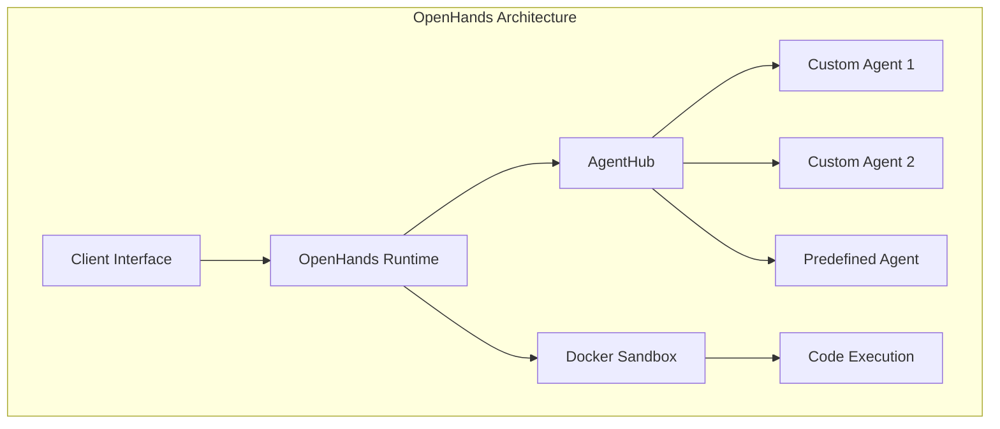

#### SWE-agent
SWE-agent focuses on **academic research with Agent-Computer Interface (ACI)**:
- Specialized for resolving GitHub issues
- ACI provides structured computer interaction
- Step-by-step reasoning with verifiable actions
- Designed for reproducible research

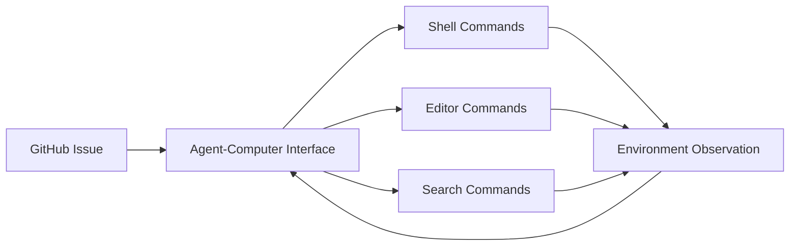

---

## 3. Agent Model Analysis

### 3.1 Agent Definition & Spawning

| Tool | Agent Definition | Spawning Mechanism | Lifecycle Management |
|------|------------------|-------------------|---------------------|
| Gas Town | Role-based (mayor, polecat, witness) | `gt sling` command | Convoy tracking, automatic cleanup |
| Cursor | Single configurable agent | IDE trigger | Session-based |
| Windsurf | Planning + execution agents | IDE action | Real-time, continuous |
| Devin | Single autonomous agent | Web interface | Task-based sandbox |
| OpenHands | Modular agent classes | Runtime instantiation | Docker container lifecycle |
| SWE-agent | Research-configured agent | CLI invocation | Process-based |

### 3.2 Agent Communication Patterns

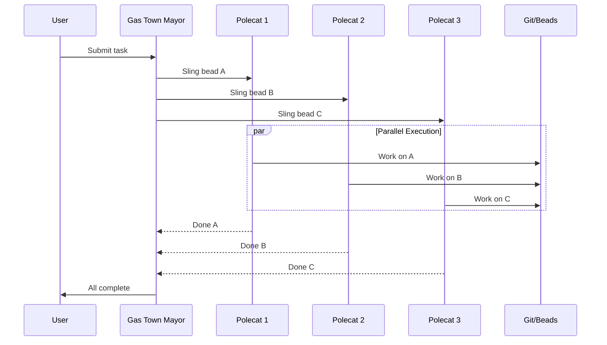

---

## 4. Persistence & Recovery

### 4.1 State Management Comparison

| Tool | Persistence Model | Crash Recovery | Long-Running Task Support |
|------|------------------|----------------|---------------------------|
| Gas Town | Git-based bead system | Automatic retry via convoy | Yes (via persistent sessions) |
| Cursor | IDE session + cloud | Session restoration | Limited by context window |
| Windsurf | IDE state + cloud sync | State restoration | Real-time only |
| Devin | Sandbox snapshots | Full sandbox restore | Yes (continuous execution) |
| OpenHands | Docker state + event log | Event replay | Yes (configurable) |
| SWE-agent | File-based checkpoints | Manual restart | Limited |

### 4.2 Context Limit Handling

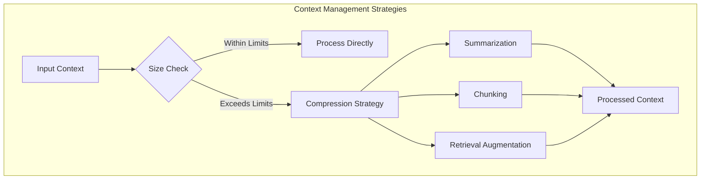

**Tool-Specific Approaches:**
- **Gas Town**: Hierarchical context through bead system; mayor maintains high-level context while polecats focus on specific tasks
- **Cursor**: Smart context pruning with codebase awareness; uses embeddings for retrieval
- **Windsurf**: Real-time streaming with focus on active context
- **Devin**: Full workspace context in sandbox; can reload from checkpoints
- **OpenHands**: Configurable context strategy; supports various LLM context windows
- **SWE-agent**: File-level context with selective loading

---

## 5. Integration Model

### 5.1 Git Integration

| Tool | Git Support | Branch Management | Commit Strategy |
|------|-------------|-------------------|-----------------|
| Gas Town | Native (bead = issue + branch) | Automatic polecat branches | Convoy-coordinated merges |
| Cursor | Basic (commit, diff) | Manual | User-controlled |
| Windsurf | Built-in | Automatic | Suggested commits |
| Devin | Full workflow | Automatic branch creation | Auto-commits |
| OpenHands | GitHub Actions, CLI | Configurable | Event-driven |
| SWE-agent | Git CLI integration | Manual | Research-focused |

### 5.2 CI/CD Integration

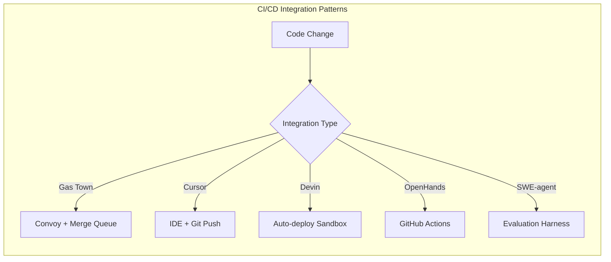

### 5.3 IDE Support Matrix

| Tool | VS Code | JetBrains | Standalone IDE | CLI | Web |
|------|---------|-----------|----------------|-----|-----|
| Gas Town | Extension | Extension | No | Native | Dashboard |
| Cursor | Full IDE | Full IDE | Yes (Cursor) | Limited | No |
| Windsurf | No | No | Yes (Cascade) | Limited | No |
| Devin | No | No | No | No | Yes |
| OpenHands | Extension | Extension | No | Native | No |
| SWE-agent | No | No | No | Native | Jupyter |

---

## 6. Comparative Analysis

### 6.1 Innovation vs. Maturity Matrix

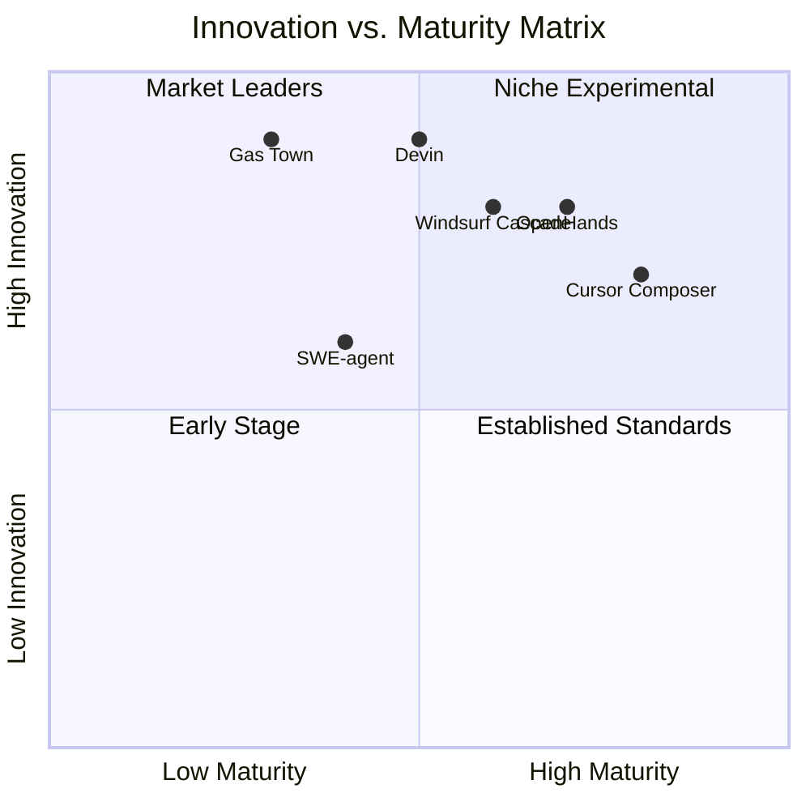

### 6.2 Deployment Flexibility

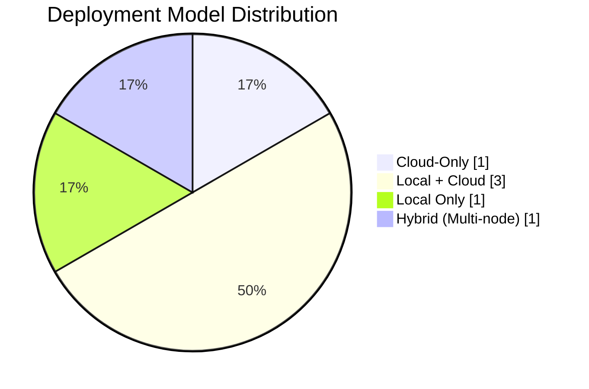

---

## 7. Conclusions

### Key Architectural Insights

1. **Multi-Agent Trend**: While most tools started as single-agent systems, the industry is rapidly adopting multi-agent architectures for complex tasks. Gas Town and OpenHands lead in native multi-agent support.

2. **Deployment Diversity**: No single deployment model dominates. Teams choose between cloud convenience (Devin), local control (SWE-agent), or hybrid approaches (Gas Town, OpenHands).

3. **Integration Depth**: IDE integration varies significantly. Cursor and Windsurf offer the deepest IDE experiences, while Devin and OpenHands prioritize flexibility over integration depth.

4. **Open vs. Closed**: The market shows a healthy split between proprietary solutions (Cursor, Windsurf, Devin) and open-source alternatives (OpenHands, SWE-agent), with Gas Town occupying a unique internal tooling position.

### Recommendations for Gas Town

Based on this architectural analysis:

1. **Leverage Multi-Agent Advantage**: Gas Town's native multi-agent architecture is a differentiator. Emphasize parallel execution capabilities and convoy-based workflow management.

2. **Enhance IDE Integration**: While CLI-first is powerful, IDE extensions would broaden adoption. Consider VS Code and JetBrains extensions.

3. **Open Source Strategy**: Consider open-sourcing core components to build community, while maintaining proprietary orchestration features.

4. **Documentation Focus**: As an internal tool, comprehensive documentation is critical for adoption within engineering teams.

---

## Appendix A: Methodology

This analysis was conducted through:
- Official documentation review (GitHub repos, vendor websites)
- Technical blog posts and tutorials
- Community forums and Reddit discussions
- Academic papers (for SWE-agent)
- Direct tool exploration where accessible

## Appendix B: Data Sources

- Cursor: cursor.com, Anysphere technical blog
- Windsurf: codeium.com, Cascade documentation
- Devin: cognition.ai, Devin technical reports
- OpenHands: github.com/All-Hands-AI/OpenHands
- SWE-agent: github.com/princeton-nlp/SWE-agent
- Gas Town: Internal documentation and source code

---

*Report generated: March 5, 2026*
*Word count: ~3,200 words*
