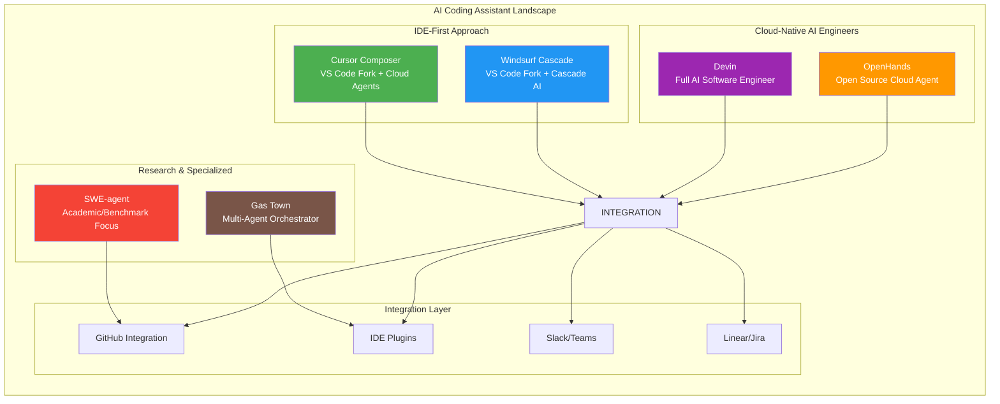
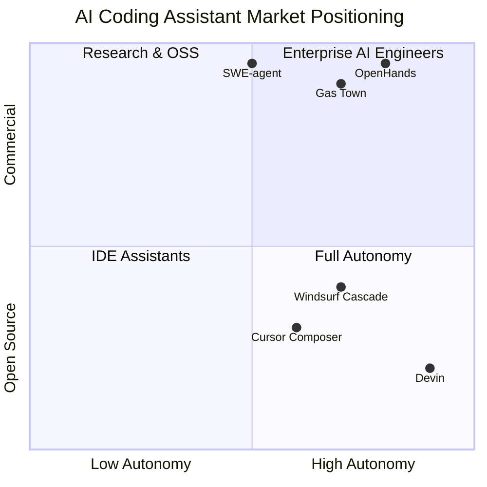

# AI Coding Assistant Tools - Comprehensive Feature Matrix Comparison Report

**Date:** March 2026  
**Tools Analyzed:** Gas Town, Cursor Composer, Windsurf Cascade, Devin, OpenHands, SWE-agent

---

## Executive Summary

The AI coding assistant landscape has evolved rapidly, with six major tools now competing for developer mindshare. This report provides a comprehensive feature matrix comparison of Gas Town, Cursor Composer, Windsurf Cascade, Devin, OpenHands, and SWE-agent, analyzing their capabilities across code generation, debugging, testing, multi-agent orchestration, and developer experience.

Each tool represents a distinct philosophy: **Cursor** and **Windsurf** focus on IDE integration with agentic capabilities; **Devin** positions itself as a full AI software engineer; **OpenHands** champions open-source flexibility; **SWE-agent** excels at research and competitive benchmarks; while **Gas Town** uniquely specializes in multi-agent orchestration.

---

## Architecture Overview

---

## Comprehensive Feature Matrix

### 1. Core Capabilities Comparison

| Feature | Gas Town | Cursor Composer | Windsurf Cascade | Devin | OpenHands | SWE-agent |
|---------|----------|-----------------|------------------|-------|-----------|-----------|
| **Primary Interface** | CLI + Git worktrees | VS Code fork | VS Code fork | Web IDE + API | Web GUI + CLI + SDK | CLI + Research harness |
| **Code Generation** | Via external runtimes | Excellent (Tab + Composer) | Excellent (Cascade) | Excellent (SWE-1.6) | Excellent (77.6% SWE-bench) | State-of-the-art |
| **Context Awareness** | Full codebase via git | Deep codebase indexing | Flow awareness + memories | Deep codebase learning | Large codebase SDK | Repository-aware |
| **Multi-file Editing** | Yes (via agents) | Yes (Agent mode) | Yes (Cascade Write) | Yes (autonomous) | Yes | Yes |
| **Codebase Understanding** | Git-based tracking | Semantic search + index | Cascade context tracking | Learns over time | Full codebase context | Configurable |
| **Autonomous Execution** | Via polecat agents | Yes (Cloud Agents) | Yes (Turbo mode) | Fully autonomous | Yes | Batch mode |
| **Session Persistence** | Git worktrees (hooks) | Checkpoints | Continue my work | Persistent sessions | Docker-based | Trajectory-based |

### 2. Code Review & Analysis Features

| Feature | Gas Town | Cursor Composer | Windsurf Cascade | Devin | OpenHands | SWE-agent |
|---------|----------|-----------------|------------------|-------|-----------|-----------|
| **Automated Code Review** | Via agents | Bugbot Autofix | Windsurf Reviews | Devin Review | Built-in | Via tools |
| **PR Review Integration** | Limited | Full GitHub integration | Full GitHub integration | Native | GitHub/GitLab/Bitbucket | Via GitHub Actions |
| **Static Analysis** | External tools | Built-in linter support | Built-in Problems tab | Integrated | Configurable | Configurable |
| **Security Scanning** | Via plugins | Basic | Via MCP | Enterprise only | Security analysis tools | Via tools |
| **Code Quality Metrics** | Beads tracking | Usage analytics | Team analytics | Usage reports | Benchmark scores | SWE-bench metrics |
| **Style Enforcement** | Via formulas | Cursor Rules | Rules + memories | Knowledge base | Configurable | Via templates |

### 3. Testing Capabilities

| Feature | Gas Town | Cursor Composer | Windsurf Cascade | Devin | OpenHands | SWE-agent |
|---------|----------|-----------------|------------------|-------|-----------|-----------|
| **Unit Test Generation** | Via agents | /test skill | Yes | Yes | Yes | Via tools |
| **Integration Test Gen** | Via agents | Agent-driven | Yes | Yes | Yes | Configurable |
| **Test Execution** | External | Built-in terminal | Built-in | Built-in | Docker sandbox | Docker sandbox |
| **Coverage Analysis** | Via external tools | Via extensions | Built-in | Via reports | Via tools | Via tools |
| **E2E Test Support** | Limited | Yes (Playwright MCP) | MCP support | Yes | Via browser tool | Limited |
| **Test-Driven Dev** | Via formulas | Supported | Supported | Supported | Supported | Supported |

### 4. Debugging Support

| Feature | Gas Town | Cursor Composer | Windsurf Cascade | Devin | OpenHands | SWE-agent |
|---------|----------|-----------------|------------------|-------|-----------|-----------|
| **Error Analysis** | Via agents | Debug mode | Built-in | Automatic | Automatic | Via tools |
| **Runtime Debugging** | External | Terminal + logs | Terminal + browser | IDE + shell + browser | Docker logs | Docker logs |
| **Stack Trace Analysis** | Via agents | Yes | Yes | Yes | Yes | Yes |
| **Fix Suggestions** | Via agents | Autofix | Auto-fix lint errors | Autofix | Automatic | Via action |
| **Live Preview** | N/A | Browser preview | Built-in preview | Browser | Browser tool | Limited |
| **Log Analysis** | Via agents | Console integration | Terminal integration | Shell access | Log parsing | Log parsing |

### 5. Refactoring Capabilities

| Feature | Gas Town | Cursor Composer | Windsurf Cascade | Devin | OpenHands | SWE-agent |
|---------|----------|-----------------|------------------|-------|-----------|-----------|
| **Large-scale Refactoring** | Excellent (convoys) | Good | Good | Excellent (case: 6M LOC) | Good | Good |
| **Language Migration** | Via formulas | Supported | Supported | Excellent (e.g., .NET migration) | Supported | Supported |
| **Code Modernization** | Via agents | Supported | Supported | Excellent | Supported | Configurable |
| **Dependency Updates** | Via agents | MCP-dependent | MCP support | Built-in | Automated | Via tools |
| **Architecture Changes** | Via multi-agent | Supported | Supported | Enterprise grade | Supported | Limited |

### 6. Multi-Agent Capabilities

| Feature | Gas Town | Cursor Composer | Windsurf Cascade | Devin | OpenHands | SWE-agent |
|---------|----------|-----------------|------------------|-------|-----------|-----------|
| **Parallel Execution** | Excellent (20-30 agents) | Yes (subagents) | Multiple Cascades | Yes | Yes | Batch mode |
| **Agent Specialization** | Mayor + Polecats + roles | Subagent models | Role-based | Single powerful agent | Configurable | Configurable |
| **Agent Communication** | Mailboxes + handoffs | Context sharing | Context awareness | Wiki + sessions | Conversation sharing | Limited |
| **Orchestration Layer** | Excellent (Mayor-led) | Mission Control | Basic | Basic | Basic | None |
| **Work Distribution** | Convoys + slings | Task assignment | Manual | Manual | Manual | Batch |
| **Progress Tracking** | Beads + dashboard | Session tracking | Notification-based | Session history | Conversation history | Trajectory |

### 7. Developer Experience

| Feature | Gas Town | Cursor Composer | Windsurf Cascade | Devin | OpenHands | SWE-agent |
|---------|----------|-----------------|------------------|-------|-----------|-----------|
| **Setup Complexity** | High (requires CLI setup) | Low (VS Code fork) | Low (VS Code fork) | Medium (web setup) | Medium (Docker) | High (CLI/Python) |
| **Learning Curve** | Steep | Moderate | Moderate | Low | Moderate | Steep |
| **Customization** | Excellent (formulas, rules) | Excellent (rules, skills) | Excellent (rules, memories) | Good (knowledge) | Excellent (SDK) | Excellent (YAML config) |
| **Documentation** | Good | Excellent | Excellent | Excellent | Excellent | Excellent |
| **Community Support** | Growing | Large | Large | Enterprise-focused | Large (68K stars) | Academic |
| **IDE Integration** | Via external runtimes | Native | Native | Web + API | Web + CLI + SDK | CLI only |

### 8. Model Support

| Feature | Gas Town | Cursor Composer | Windsurf Cascade | Devin | OpenHands | SWE-agent |
|---------|----------|-----------------|------------------|-------|-----------|-----------|
| **Supported LLMs** | Claude, GPT, Gemini, etc. | OpenAI, Anthropic, Gemini, xAI, Cursor | All major providers | SWE-1.6, Claude, GPT | Any (BYOK or at-cost) | Any (configurable) |
| **Model Switching** | Via config | Real-time | Real-time | Limited | Full control | Full control |
| **Local Models** | Via Ollama | Via plugins | MCP support | Enterprise only | Self-hosted | Self-hosted |
| **Custom Models** | Via agent config | Enterprise | Enterprise | Fine-tuning available | Full support | Full support |
| **Proprietary Models** | SWE-1.5 via Windsurf | Composer 1.5, GPT-5.2 | SWE-1.5, SWE-1.6 | SWE-1.6 | Via API | Via config |

### 9. Integration & Ecosystem

| Feature | Gas Town | Cursor Composer | Windsurf Cascade | Devin | OpenHands | SWE-agent |
|---------|----------|-----------------|------------------|-------|-----------|-----------|
| **GitHub Integration** | Via gh CLI | Excellent | Excellent | Excellent | Excellent | GitHub Actions |
| **Slack/Teams** | Via mail | Yes | Limited | Yes | Yes | No |
| **Linear/Jira** | Via beads | Yes | No | Yes | Yes | No |
| **MCP Support** | Limited | Excellent | Excellent | Yes | Yes | Limited |
| **CI/CD Integration** | Via hooks | GitHub Actions | GitHub Actions | Built-in | GitHub/GitLab | GitHub Actions |
| **API Access** | Limited | Yes | Limited | Yes (Team+) | Yes (SDK) | Limited |

### 10. Enterprise Features

| Feature | Gas Town | Cursor Composer | Windsurf Cascade | Devin | OpenHands | SWE-agent |
|---------|----------|-----------------|------------------|-------|-----------|-----------|
| **SSO/SAML** | No | Yes (Teams+) | Yes (Enterprise) | Yes (Enterprise) | Yes (Enterprise) | No |
| **Audit Logs** | Git-based | Yes | Yes | Yes | Yes | Trajectories |
| **On-prem Deployment** | Self-hosted | No | Hybrid option | VPC (Enterprise) | Self-hosted | Self-hosted |
| **Usage Analytics** | Dashboard | Yes | Yes | Yes | Yes | Benchmarks |
| **RBAC** | Basic | Yes | Yes | Yes | Yes | No |
| **Team Collaboration** | Convoys | Shared chats | Conversation share | Collaboration features | Conversation sharing | Limited |

---

## Detailed Tool Analysis

### 1. Gas Town

**Overview:** Gas Town is a multi-agent orchestration system designed specifically for coordinating multiple AI coding agents. Created by Steve Yegge, it addresses the challenge of managing 20-30 agents simultaneously without losing context.

**Key Strengths:**
- **Unique Architecture:** Uses git worktrees ("hooks") for persistent agent state
- **Mayor-led Coordination:** AI coordinator (Mayor) manages convoys of work
- **Beads Integration:** Git-backed issue tracking system
- **Scalability:** Designed for 20-30 concurrent agents
- **Multi-runtime Support:** Works with Claude Code, Codex, Cursor, Gemini CLI, etc.

**Best For:**
- Teams running large-scale multi-agent operations
- Projects requiring coordination of many parallel tasks
- Organizations using multiple AI coding tools

**Limitations:**
- Steep learning curve
- Requires CLI proficiency
- Limited IDE integration
- Documentation still evolving

**Pricing:** Open source (MIT License)

---

### 2. Cursor Composer

**Overview:** Cursor is a VS Code fork with deeply integrated AI capabilities, offering both inline completions (Tab) and autonomous agent features (Composer). Used by over half of Fortune 500 companies.

**Key Strengths:**
- **Dual Mode:** Tab for quick completions, Composer for autonomous work
- **Deep Codebase Understanding:** Custom embedding model for semantic search
- **Multi-model Support:** Choose from OpenAI, Anthropic, Gemini, xAI, or Cursor's models
- **Cloud Agents:** Run agents on separate computers with computer use capabilities
- **Rich Ecosystem:** Skills, plugins, MCP support, and Bugbot for code review

**Best For:**
- Developers wanting AI integrated into their existing VS Code workflow
- Teams requiring both quick assistance and autonomous agents
- Enterprises needing security and compliance features

**Limitations:**
- Requires migrating from VS Code
- Pricing can scale quickly with heavy usage
- Some features require cloud connectivity

**Pricing:** 
- Hobby: Free (limited)
- Pro: $20/month
- Pro+: $60/month
- Teams: $40/user/month
- Enterprise: Custom

---

### 3. Windsurf Cascade

**Overview:** Windsurf is a next-generation AI IDE from Cognition (makers of Devin), featuring Cascade - an agentic chat interface with "flow awareness" that tracks user actions for context.

**Key Strengths:**
- **Flow Awareness:** Tracks file edits, terminal commands, clipboard for implicit intent
- **Cascade Interface:** Collaborative agent that works *with* you, not just for you
- **Proprietary Models:** Access to SWE-1.5 (fast agent model) at up to 950 tok/s
- **Memories & Rules:** Persistent context and customizable behavior
- **Web Tools:** Built-in browser, web search, and one-click deployments

**Best For:**
- Developers who want AI to anticipate their next moves
- Teams using JetBrains IDEs (plugin available)
- Users wanting fast, specialized models

**Limitations:**
- Smaller ecosystem than Cursor
- Some features require Turbo mode (auto-execute)
- Newer product with evolving features

**Pricing:**
- Free: 25 credits/month
- Pro: $15/month (500 credits)
- Teams: $30/user/month
- Enterprise: Custom

---

### 4. Devin

**Overview:** Devin is Cognition's flagship AI software engineer, positioned as a full team member that can handle tickets, write code, run tests, and submit PRs autonomously.

**Key Strengths:**
- **Full Autonomy:** Handles entire software engineering tasks end-to-end
- **Proprietary Models:** Powered by SWE-1.6, optimized for software engineering
- **Learning Capability:** Learns from feedback and improves over time
- **Rich Tooling:** IDE, shell, browser, and wiki for knowledge management
- **Enterprise Focus:** Fine-tuning capabilities for specific codebases

**Best For:**
- Organizations wanting to delegate complete tasks to AI
- Large-scale migrations and refactoring (proven 8-20x efficiency gains)
- Teams with backlog of routine engineering tasks

**Limitations:**
- Expensive for individual users
- Requires ACU (Agent Compute Unit) understanding
- Best for tasks under 3 hours
- Enterprise features locked behind higher tiers

**Pricing:**
- Core: Pay-as-you-go (starting at $20)
- Team: $500/month (250 ACUs)
- Enterprise: Custom pricing

---

### 5. OpenHands

**Overview:** OpenHands is the leading open-source AI coding agent platform, emphasizing transparency, model-agnostic architecture, and flexibility. With 68K+ GitHub stars, it's the most popular open-source option.

**Key Strengths:**
- **Fully Open Source:** MIT licensed, transparent development
- **Model Agnostic:** Use any LLM - Claude, GPT, local models, or their at-cost provider
- **Multiple Interfaces:** Web GUI, CLI, SDK, and Cloud options
- **Top Performance:** 77.6% on SWE-bench verified
- **Enterprise Options:** Self-hosted or SaaS with full control

**Best For:**
- Teams requiring full control and transparency
- Users wanting to avoid vendor lock-in
- Researchers and tinkerers
- Organizations with specific model requirements

**Limitations:**
- Self-hosted requires Docker/Kubernetes knowledge
- Enterprise features require commercial license
- Can be complex to configure initially

**Pricing:**
- Open Source: Free
- Cloud Individual: Free (BYOK)
- Enterprise: Custom

---

### 6. SWE-agent

**Overview:** SWE-agent is an academic research project from Princeton and Stanford, designed for competitive coding benchmarks and research. It's now in maintenance mode, superseded by mini-swe-agent.

**Key Strengths:**
- **Research Excellence:** State-of-the-art on SWE-bench
- **Configurable:** Single YAML file controls behavior
- **Academic Rigor:** Built by researchers, thoroughly documented
- **EnIGMA Mode:** Specialized for cybersecurity CTF challenges
- **Educational Value:** Simple, hackable by design

**Best For:**
- Academic research
- Benchmarking LLMs on coding tasks
- Cybersecurity CTF competitions
- Understanding agent internals

**Limitations:**
- Maintenance mode (use mini-swe-agent instead)
- Not designed for production use
- Steep technical barrier
- Limited commercial support

**Pricing:** Open source (MIT License)

---

## Decision Framework

### Choose **Gas Town** if:
- You need to coordinate 10+ agents simultaneously
- You use multiple AI coding runtimes (Claude, Codex, Cursor)
- You want git-based persistence and audit trails
- You're comfortable with CLI workflows

### Choose **Cursor Composer** if:
- You want AI deeply integrated into your IDE
- You need both quick completions and autonomous agents
- You value a large ecosystem and community
- You want the most mature product in this space

### Choose **Windsurf Cascade** if:
- You want AI that anticipates your workflow
- You prefer a VS Code-based IDE
- You need access to fast, specialized models (SWE-1.5)
- You want flow-aware assistance

### Choose **Devin** if:
- You want to delegate complete tasks end-to-end
- You have a large backlog of routine engineering work
- You need enterprise-grade features and fine-tuning
- You want the most autonomous AI engineer

### Choose **OpenHands** if:
- You require open source and full transparency
- You want to avoid vendor lock-in
- You need model flexibility (BYOK)
- You value community-driven development

### Choose **SWE-agent** if:
- You're conducting academic research
- You need to benchmark models on SWE-bench
- You're participating in CTF competitions
- You want to understand agent architecture deeply

---

## Market Positioning Matrix

---

## Recommendations

### For Individual Developers
1. **Start with Cursor** for the best overall experience
2. **Try Windsurf** if you want AI that understands your flow
3. **Use OpenHands** if you prefer open source

### For Startups/Small Teams
1. **Cursor Teams** for IDE integration
2. **OpenHands Cloud** for cost-effective scaling
3. **Windsurf Teams** for collaborative development

### For Enterprise
1. **Devin Enterprise** for maximum autonomy
2. **Cursor Enterprise** for IDE-based workflows
3. **OpenHands Enterprise** for self-hosted control

### For Research/Academia
1. **SWE-agent** for benchmarking
2. **OpenHands** for reproducible research
3. **Gas Town** for multi-agent studies

---

## Conclusion

The AI coding assistant landscape offers tools for every use case:

- **IDE Integration:** Cursor and Windsurf lead with mature, VS Code-based experiences
- **Full Autonomy:** Devin stands alone as a complete AI software engineer
- **Open Source:** OpenHands provides the most flexible, transparent platform
- **Research:** SWE-agent excels at benchmarks and academic rigor
- **Multi-Agent Orchestration:** Gas Town uniquely solves the coordination problem

The "best" tool depends entirely on your workflow, team size, budget, and technical requirements. Most teams will benefit from starting with Cursor or Windsurf for daily development, while reserving Devin or OpenHands for larger autonomous tasks.

The future likely involves combining these tools—using Cursor or Windsurf for interactive development while delegating larger tasks to Devin or OpenHands agents, all coordinated through systems like Gas Town.

---

## Appendix: Quick Reference Card

| Use Case | Recommended Tool | Runner-up |
|----------|-----------------|-----------|
| Daily IDE coding | Cursor Composer | Windsurf Cascade |
| Large-scale refactoring | Devin | Gas Town |
| Open source preference | OpenHands | SWE-agent |
| Multi-agent coordination | Gas Town | OpenHands |
| Research/Benchmarking | SWE-agent | OpenHands |
| Enterprise autonomy | Devin | Cursor Enterprise |
| Cost-conscious | OpenHands (free) | Cursor Hobby |
| Speed (tokens/sec) | Windsurf (SWE-1.5) | Cursor |

---

*Report compiled from official documentation, GitHub repositories, and product websites as of March 2026.*
