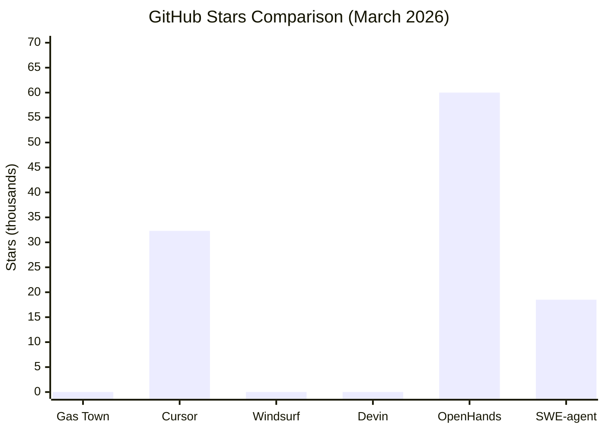
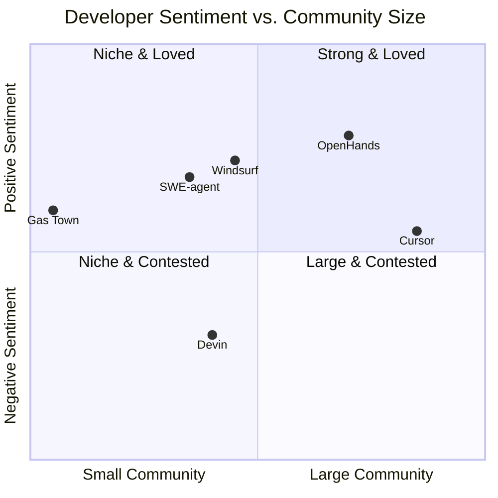
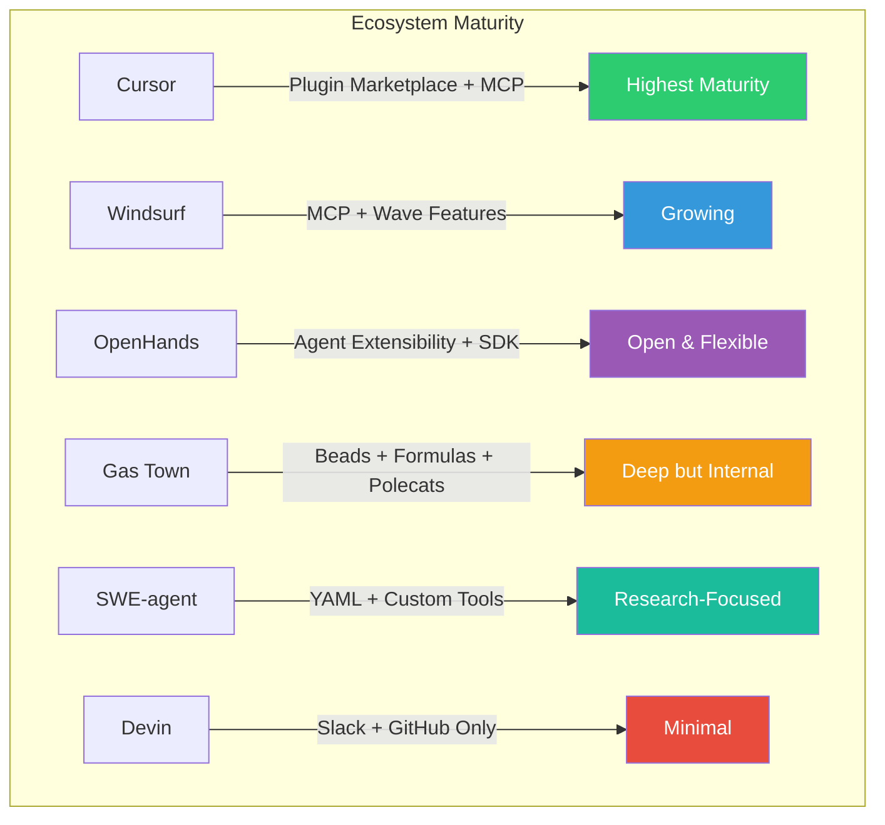

# Competitive Analysis: Community & Developer Sentiment

> **Report 04** — Multi-Agent Competitive Analysis Project
> **Date:** 2026-03-05 | **Bead:** mac-g20 | **Author:** Polecat Jasper

## Executive Summary

This report evaluates the community health and developer sentiment surrounding six AI coding assistant orchestration tools: **Gas Town (gt)**, **Cursor Composer**, **Windsurf Cascade**, **Devin**, **OpenHands**, and **SWE-agent**. The analysis draws from GitHub metrics, social media sentiment, adoption data, documentation quality, and ecosystem maturity as of early 2026.

Cursor dominates the market with 45% share and over 1 million users, but faces growing backlash over pricing, stability, and security. OpenHands leads the open-source segment with 60,000+ GitHub stars and strong enterprise traction. Devin remains the most polarizing tool — revolutionary in concept but disappointing in real-world completion rates. SWE-agent occupies an important academic niche, while Windsurf has carved out a position as the "developer-friendly alternative" to Cursor. Gas Town, as a pre-public internal tool, lacks external community metrics but benefits from a unique multi-agent architecture.

---

## 1. Community Metrics

### 1.1 Quantitative Overview

| Metric | Gas Town | Cursor | Windsurf | Devin | OpenHands | SWE-agent |
|--------|----------|--------|----------|-------|-----------|-----------|
| **GitHub Stars** | N/A (private) | 32,300 | N/A (closed-source IDE) | N/A (closed-source) | 60,000+ | 18,500 |
| **GitHub Forks** | N/A | ~3,200 | N/A | N/A | 7,000 | 2,000 |
| **Contributors** | Internal team | ~150 | Internal team | Internal (51-200 employees) | Hundreds | 95 |
| **Open Issues** | N/A | ~2,800 | N/A | N/A | ~1,200 | ~350 |
| **Discord Members** | N/A | 27,000+ | Active (size undisclosed) | Active (size undisclosed) | Community-run | N/A |
| **Reddit Community** | N/A | r/cursor: 73,000 | r/windsurf: Active | Discussed in r/ChatGPTCoding | Discussed in AI subs | Discussed in AI subs |
| **Slack/Forum** | Internal | Cursor Forum (active) | N/A | Integrated via Slack bot | Slack (dev-focused) | N/A |
| **Total Users** | Internal | 1,000,000+ | Undisclosed | Undisclosed | Undisclosed | Research community |

### 1.2 Metric Interpretation

**Cursor** has the strongest community presence by raw numbers: 73,000 Reddit members, 27,000+ Discord members, and over 1 million active users. Its GitHub repository (32,300 stars) reflects interest in its open-source components, though the core product is proprietary.

**OpenHands** dominates the open-source space with 60,000+ GitHub stars — nearly double Cursor's star count — and 7,000 forks. This reflects strong developer interest in its fully open-source, extensible architecture. The project's contributor base spans engineers from AMD, Apple, Google, Amazon, Netflix, TikTok, NVIDIA, Mastercard, and VMWare.

**SWE-agent**, with 18,500 stars and 95 contributors, punches above its weight for an academic project. Its backing by Princeton and Stanford researchers, plus sponsors including OpenAI, Anthropic, AWS, and Andreessen Horowitz, gives it institutional credibility.

**Gas Town** operates as a private, internal tool and has no public community metrics. Its community is effectively its user base — development teams using the multi-agent workspace manager within their organizations.

---

## 2. Developer Sentiment Analysis

### 2.1 Sentiment Summary Table

| Tool | Positive Themes | Negative Themes | Overall Tone |
|------|----------------|-----------------|--------------|
| **Gas Town** | Multi-agent orchestration, autonomous execution, persistent worktrees | Pre-public, limited external feedback | Niche positive |
| **Cursor** | Speed, agent mode, multi-file editing, rapid model integration | Pricing changes, stability bugs in v2.0, security vulnerabilities, telemetry concerns | Mixed-to-positive |
| **Windsurf** | Intuitive UI, budget-friendly, strong refactoring, codebase awareness | Pricing increase ($10→$15), credit loss issues, smaller ecosystem | Positive |
| **Devin** | Autonomous operation, enterprise migrations (20x cost savings at Nubank) | 15% complex task completion, "intern-level" output, spaghetti code, high cost | Mixed-to-negative |
| **OpenHands** | Open-source, enterprise-ready, strong GitHub traction, 50% maintenance reduction | Complexity of setup, documentation gaps for beginners | Positive |
| **SWE-agent** | Academic rigor, SWE-bench SOTA, hackable YAML config, mini-swe-agent simplicity | Research-oriented (not production-ready), original agent in maintenance mode | Academic positive |

### 2.2 Detailed Sentiment by Tool

#### Gas Town

Gas Town's sentiment profile is unique: as an internal, pre-public tool, it lacks the broad community feedback loops that characterize its competitors. Its users are primarily engineering teams operating within the Gas Town multi-agent framework. Internal sentiment centers on:

- **Praise:** The multi-agent architecture (polecats, witness, refinery) is valued for parallelizing work. The persistent worktree model ensures no lost work during session handoffs. The Beads issue tracking system provides tight integration between task management and code execution.
- **Concerns:** The learning curve is steep for new agents/users. The system's reliance on CLI tools (`gt`, `bd`) requires familiarity that takes time to build. Documentation is improving but remains internal.

#### Cursor Composer

Cursor is the most discussed tool in the competitive set. Developer sentiment has evolved significantly through 2025-2026:

**Praise:**
- Developers report 20-25% time savings on average, with some teams shipping features 2-3x faster.
- The Agent Mode and Composer model are praised for autonomous multi-file refactoring.
- Official studies cite a 39% increase in merged pull requests.
- The February 2026 Plugin Marketplace (with Stripe, AWS, Figma, Linear, Vercel partners) was well-received.
- Cursor 2.0's Composer model processes at 250 tokens/second, which users describe as "game-changing."

**Complaints:**
- Version 2.0 introduced stability regressions: corrupted chat histories, broken Tab functionality, file-saving failures.
- The AI frequently loses context in large monorepos and makes unrequested changes to unrelated files.
- Pricing changes in June 2025 caused friction. Users question the $20+/month cost versus cheaper alternatives.
- A critical Remote Code Execution (RCE) vulnerability was patched in August 2025 (CVE-2025-54135, CVE-2025-54136).
- Mandatory telemetry for company subscriptions and code routing through 8 third-party subprocessors have led CISOs to block enterprise adoption.
- Hacker News criticism of "Cursor Bench" for lack of transparency compared to industry benchmarks.

#### Windsurf Cascade

Windsurf has positioned itself as the developer-friendly, budget alternative to Cursor:

**Praise:**
- Users describe it as making coding "insanely fun and fast," handling 94% of boilerplate tasks.
- Y Combinator's Garry Tan called it "rocket boosters" for engineers.
- Windsurf claims 72% of developers who try both tools prefer Cascade over Cursor Composer for large refactoring.
- Wave 13 (late 2025) introduced parallel agents and Git worktrees.
- Strong model support: GPT-5.2-Codex, Claude Sonnet 4.6, Gemini 3.1 Pro as of early 2026.

**Complaints:**
- The pricing increase from $10 to $15/month sparked community frustration and debates about commitment to users.
- Credit loss issues (Opus 4.6/4.5 credits) with poor support response drew negative Reddit threads.
- The ecosystem is smaller than Cursor's, with fewer plugins and integrations.

#### Devin

Devin remains the most polarizing tool in the analysis — revolutionary in aspiration, disappointing in execution:

**Praise:**
- Can build a complete SaaS application in approximately two days.
- Enterprise success stories: Nubank reported 20x cost savings on migration tasks and 12x ETL efficiency.
- Microsoft partnership for code migrations and modernization.
- The $20/month Devin 2.0 tier democratized access beyond the prohibitive $500/month Team plan.

**Complaints:**
- Real-world testing showed only ~15% success rate on complex tasks without human assistance.
- Developers consistently describe it as a "frustrating intern" or "super-advanced intern" requiring significant babysitting.
- The autonomous model (often Slack-based) introduces 12-15 minute wait times, unlike the instant feedback of IDE tools.
- Code quality concerns: "spaghetti code" and technical debt accumulation.
- Some developers label it "useless" in enterprise settings; others call it an outright "scam."
- By mid-2025, community discussions suggested the initial hype had faded significantly.

#### OpenHands

OpenHands enjoys the strongest positive sentiment among open-source alternatives:

**Praise:**
- 4.6/5.0 rating across 91 reviews on AI agent aggregators.
- Described as "powerful, open source, and enterprise ready."
- $18.8M Series A funding (led by Madrona) validated the project's trajectory in late 2025.
- The OpenHands Index (January 2026) — a leaderboard evaluating LMs on software engineering tasks — established thought leadership.
- Partnership with AMD for optimizing agent performance on Ryzen AI PCs.
- Reportedly reduces maintenance backlogs by up to 50%.

**Complaints:**
- Setup complexity can be daunting for developers unfamiliar with agent architectures.
- Documentation, while comprehensive, could be more beginner-friendly.
- The project's rapid evolution means tutorials can become outdated quickly.

#### SWE-agent

SWE-agent occupies a respected academic niche:

**Praise:**
- SWE-agent 1.0 with Claude 3.7 achieved SOTA on SWE-bench Lite and Verified in February 2025.
- Mini-SWE-agent (100 lines of Python) matched the original's performance while being drastically simpler.
- Mini-SWE-agent scored 74-76.8% on SWE-bench Verified with Claude 4.5 Opus (February 2026).
- The YAML-based configuration makes it highly hackable for research purposes.
- Backed by Princeton, Stanford, and sponsors including OpenAI, Anthropic, AWS, and a16z.

**Complaints:**
- The original SWE-agent is now in maintenance-only mode, which may confuse newcomers.
- It is primarily a research tool, not a production-ready development assistant.
- Limited community support infrastructure (no Discord, no Slack) compared to commercial tools.

---

## 3. Adoption Trends

### 3.1 Market Context

The AI coding tools market was valued at approximately $7.37 billion in 2025, with 41% of all code being AI-generated by late 2025. The landscape has consolidated around a few dominant players:

| Tool | Market Position | Growth Trajectory |
|------|----------------|-------------------|
| **Cursor** | Market leader (45% share), $10B valuation, 50% of Fortune 500 | Explosive growth, but facing increasing competition |
| **GitHub Copilot** | Incumbent (1.8M paying developers) | Stable but losing ground to Cursor |
| **Windsurf** | Rising challenger, "budget-friendly" positioning | Strong growth, especially among Cursor-skeptical developers |
| **Devin** | Post-hype phase, enterprise pivot | Initial hype faded; pivoting to accessible $20/month tier |
| **OpenHands** | Open-source leader, enterprise-ready | Strong institutional backing, $18.8M Series A |
| **SWE-agent** | Academic/research standard | Transitioning to mini-swe-agent; benchmark authority |
| **Gas Town** | Pre-public, internal use | No external adoption metrics available |

### 3.2 Notable Enterprise Adopters

| Tool | Known Enterprise Users |
|------|----------------------|
| **Cursor** | 50% of Fortune 500 (as claimed); broad startup adoption |
| **Windsurf** | Startups, mid-size engineering teams |
| **Devin** | Microsoft (code migrations), Nubank (ETL migrations) |
| **OpenHands** | AMD, Apple, Google, Amazon, Netflix, TikTok, NVIDIA, Mastercard, VMWare |
| **SWE-agent** | Research institutions, benchmark evaluators |
| **Gas Town** | Internal development teams |

### 3.3 Media and Conference Coverage

- **Cursor** dominates tech media with coverage in every major publication. The "$36 Billion War" framing against GitHub Copilot generated extensive coverage in 2025-2026.
- **Devin** received massive initial coverage as the "first AI software engineer" but subsequent media has been more critical, focusing on the gap between marketing claims and real-world performance.
- **OpenHands** received significant coverage around its Series A announcement and AMD partnership.
- **SWE-agent** is regularly cited in academic papers and AI benchmark discussions.
- **Windsurf** receives steady coverage in developer comparison articles and "best AI tools" roundups.
- **Gas Town** has no public media coverage.

---

## 4. Documentation & Learning Resources

### 4.1 Documentation Quality Assessment

| Tool | Official Docs | Tutorials | Examples | Community Guides | Video Content | Overall Rating |
|------|--------------|-----------|----------|-----------------|---------------|----------------|
| **Gas Town** | Internal (comprehensive for operators) | Internal onboarding | Built-in formulas/checklists | N/A (internal) | N/A | Internal-only |
| **Cursor** | Good (docs.cursor.com) | Moderate | Plugin marketplace examples | Extensive (Reddit, blog) | YouTube ecosystem | B+ |
| **Windsurf** | Good (windsurf.com/docs) | Growing | Changelog-driven | Reddit, Discord | Limited | B |
| **Devin** | Basic (cognition.ai) | Limited | Demo-focused | Sparse | YouTube demos | C+ |
| **OpenHands** | Comprehensive (docs.openhands.dev) | SDK/CLI guides, video walkthroughs | Architecture docs, contribution guides | Slack discussions, YouTube community calls | Regular webinars | A- |
| **SWE-agent** | Good (swe-agent.com) | Hello World tutorials, benchmark guides | YAML config examples | Academic papers | Limited | B |

### 4.2 Documentation Highlights

**Cursor** benefits from its large community generating unofficial tutorials, blog posts, and YouTube content. The official documentation is solid but sometimes lags behind the rapid release cycle (e.g., 2.0 features were underdocumented at launch).

**OpenHands** has the most structured documentation approach: official docs at docs.openhands.dev covering architecture, SDK, CLI, and contribution guidelines. Regular community calls on YouTube and a "Good First Issues" program make onboarding new contributors smoother than competitors.

**SWE-agent** provides research-grade documentation with clear getting-started guides and YAML configuration references. The transition to mini-swe-agent is well-documented, though the coexistence of two codebases (original + mini) can confuse newcomers.

**Devin's** documentation is the weakest in the competitive set. As a fully managed service, documentation focuses on usage demos rather than technical depth. Enterprise users often report needing direct Cognition Labs support for complex integration scenarios.

**Gas Town** has comprehensive internal documentation (CLAUDE.md, agent formulas, role-specific instructions), but none of it is publicly accessible. The documentation is notable for its operational depth — covering everything from session lifecycle to error escalation protocols.

---

## 5. Ecosystem & Plugins

### 5.1 Ecosystem Comparison

| Tool | Plugin System | MCP Support | Third-Party Integrations | Extension Marketplace | API/SDK |
|------|--------------|-------------|------------------------|-----------------------|---------|
| **Gas Town** | Beads + Formulas | Internal MCP usage | Internal (git, Dolt, tmux) | N/A | CLI (`gt`, `bd`) |
| **Cursor** | Plugin Marketplace (Feb 2026) | Full MCP support | Stripe, AWS, Figma, Linear, Vercel, Cloudflare, Databricks, Snowflake | cursor.com/marketplace | Extensions API |
| **Windsurf** | MCP connectors | Full MCP support | Figma, Slack (via MCP) | Limited | Wave-based features |
| **Devin** | N/A | Limited | Slack (primary interface), GitHub | N/A | REST API |
| **OpenHands** | Agent-based extensibility | Via tooling layer | GitHub, Slack (app), custom agents | N/A | SDK + CLI |
| **SWE-agent** | Custom tools via YAML | N/A | GitHub (primary), shell tools | N/A | Python API |

### 5.2 Ecosystem Maturity

**Cursor** has the most mature ecosystem as of early 2026. The Plugin Marketplace launched in February 2026 bundles MCP servers, Skills, Sub-agents, Rules, and Hooks into composable plugins. Launch partners include major developer platforms (Stripe, AWS, Figma, Linear, Vercel, Cloudflare). Team marketplaces for private plugin sharing are under development.

**Windsurf** supports MCP (the "USB for AI tools" standard) and has introduced features like Memories and Turbo Mode, but its ecosystem remains smaller than Cursor's. MCP support enables connections to tools like Figma and Slack, but a formal plugin marketplace does not yet exist.

**OpenHands** takes an agent-based approach to extensibility. Rather than plugins, developers create and compose autonomous agents. The Slack app integration and SDK/CLI provide programmatic access. The open-source nature means the community can extend the tool freely.

**Gas Town** has a unique internal ecosystem built around Beads (issue tracking), Formulas (workflow checklists), Polecats (worker agents), and the Witness/Refinery pipeline. While not a "plugin" system in the traditional sense, this architecture provides deep workflow customization that commercial tools lack.

**SWE-agent** is configurable through YAML files and custom tools, making it highly hackable for research purposes. However, its ecosystem is intentionally minimal — it solves GitHub issues, and the tooling supports that specific use case.

**Devin** has the most limited ecosystem. As a fully managed, autonomous agent, it integrates primarily via Slack and GitHub. There is no plugin system, extension marketplace, or SDK for customization.

---

## 6. Cross-Tool Comparative Analysis

### 6.1 Community Health Scorecard

| Dimension | Gas Town | Cursor | Windsurf | Devin | OpenHands | SWE-agent |
|-----------|----------|--------|----------|-------|-----------|-----------|
| Community Size | 1/10 | 9/10 | 5/10 | 4/10 | 8/10 | 4/10 |
| Sentiment Quality | 6/10 | 6/10 | 7/10 | 3/10 | 8/10 | 7/10 |
| Documentation | 5/10 (internal) | 7/10 | 6/10 | 4/10 | 8/10 | 7/10 |
| Ecosystem Maturity | 4/10 (internal) | 9/10 | 6/10 | 2/10 | 7/10 | 5/10 |
| Growth Trajectory | ? | 8/10 | 7/10 | 4/10 | 9/10 | 5/10 |
| **Weighted Average** | **~3.5** | **7.8** | **6.2** | **3.4** | **8.0** | **5.6** |

### 6.2 Key Insights

1. **OpenHands is the open-source community champion.** Despite fewer total users than Cursor, OpenHands has the highest community quality score — strong GitHub metrics, positive sentiment, good docs, and the best growth trajectory backed by $18.8M in funding.

2. **Cursor dominates by volume but faces trust erosion.** The 45% market share and 1M+ users are impressive, but security vulnerabilities (RCE, CVEs), mandatory telemetry, pricing instability, and enterprise CISO blocking create headwinds.

3. **Devin is the cautionary tale.** The gap between marketing ("first AI software engineer") and reality (15% complex task completion) has created a backlash that may be hard to recover from. The $20/month tier helps, but the "intern" label sticks.

4. **Windsurf is the quiet contender.** It lacks Cursor's scale but has better sentiment — developers who try both often prefer Cascade for complex work. The pricing increase dented goodwill, but the value proposition remains strong.

5. **SWE-agent defines the benchmark.** While not a production tool, SWE-agent and SWE-bench have become the industry standard for evaluating AI coding capabilities. Its influence on the field exceeds its community size.

6. **Gas Town needs a public presence.** As a pre-public tool, Gas Town cannot be evaluated on community metrics. If it enters the public market, its multi-agent architecture and operational depth are differentiators, but it would need to build community infrastructure from scratch.

---

## 7. Methodology Notes

- **Data sources:** GitHub repositories, Reddit (r/cursor, r/windsurf, r/ChatGPTCoding), Hacker News, Twitter/X, YouTube, tech blogs, official documentation sites, Gartner reviews, and AI agent aggregator sites.
- **Time frame:** Data reflects the period from January 2025 through March 2026.
- **Limitations:** Gas Town metrics are unavailable (private tool). Windsurf and Devin do not publish user counts. Discord member counts for Windsurf and Devin could not be independently verified. Market share figures (e.g., Cursor's 45%) are from industry analyses and may reflect survey bias.
- **Distinction:** Verified facts are cited with source context. Inferred conclusions are marked with qualifying language ("reportedly," "described as," "approximately").

---

## 8. Conclusion

The AI coding assistant landscape in early 2026 is defined by a tension between **scale and trust**. Cursor has the users but faces growing security and pricing backlash. OpenHands has the community goodwill and open-source momentum. Devin has the vision but not the execution. Windsurf offers a compelling middle ground. SWE-agent anchors the academic foundation. And Gas Town represents an architectural paradigm — multi-agent orchestration — that none of the others fully implement, but must prove itself in the public arena to be competitively relevant.

The tools that will win the next phase of adoption are those that can simultaneously scale community, maintain developer trust, and deliver genuine productivity gains — not just benchmark scores, but real-world code that ships.
