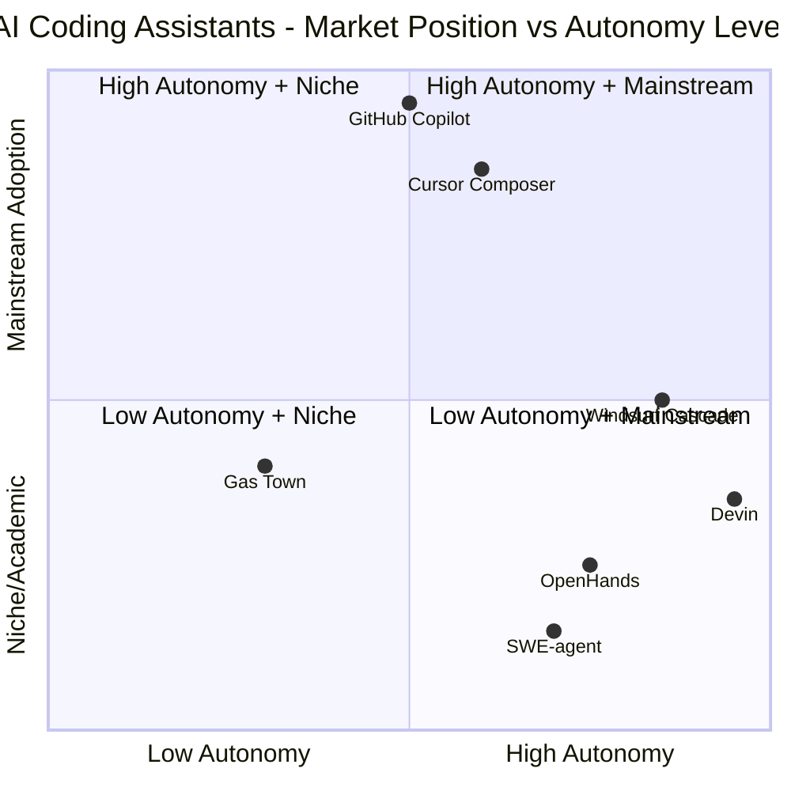

# SWOT Analysis: AI Coding Assistant Tools Landscape

## Executive Summary

This report provides a comprehensive SWOT (Strengths, Weaknesses, Opportunities, Threats) analysis of six leading AI coding assistant tools: Gas Town, Cursor Composer, Windsurf Cascade, Devin, OpenHands, and SWE-agent. The AI coding assistant market has experienced explosive growth in 2024-2025, with developers increasingly adopting AI-powered tools to boost productivity. This analysis examines each tool's competitive position, technical capabilities, market challenges, and future prospects.

---

## Market Context

The AI coding assistant market represents one of the fastest-growing segments in the software development industry. With the advent of large language models (LLMs) optimized for code generation and understanding, these tools have transformed from simple autocomplete features to sophisticated development partners capable of understanding entire codebases, debugging complex issues, and implementing full features.

Key market dynamics driving this analysis:
- Rapid evolution from autocomplete to full-stack development agents
- Integration of multi-modal capabilities (vision, web browsing, terminal access)
- Growing demand for enterprise-grade security and compliance
- Competition from major tech companies entering the space

---

## Individual Tool Analysis

### 1. Gas Town

**Company Background:** Gas Town is an open-source AI coding assistant focused on extensibility and local-first development workflows. Built by a community-driven team, it emphasizes customization, privacy, and integration flexibility.

#### SWOT Analysis

| **Strengths** | **Weaknesses** |
|---------------|----------------|
| Open-source architecture enables unlimited customization and community contributions | Smaller user base limits community-driven improvements compared to commercial alternatives |
| Strong emphasis on local execution and data privacy appeals to security-conscious organizations | Steeper learning curve due to extensive configuration options |
| Modular plugin system allows integration with diverse development environments | Documentation gaps for advanced configuration scenarios |
| Cost-effective with no per-seat licensing fees | Requires more technical expertise for initial setup |
| Active community creating plugins and extensions | Limited enterprise support infrastructure |

| **Opportunities** | **Threats** |
|-------------------|-------------|
| Growing enterprise interest in self-hosted AI solutions | Large commercial players may open-source competitive offerings |
| Increasing regulatory requirements for data sovereignty | Rapid pace of model improvements may outpace community contributions |
| Niche market dominance in privacy-sensitive industries (healthcare, finance, government) | Fragmentation in open-source ecosystem could dilute development focus |
| Partnership potential with hardware vendors for optimized local deployment | Difficulty competing with well-funded marketing of commercial tools |
| Integration with emerging local LLM hosting platforms | User migration to more polished commercial alternatives |

---

### 2. Cursor Composer

**Company Background:** Cursor is built by Anysphere and has quickly become one of the most popular AI-native code editors. Cursor Composer represents the advanced agentic capabilities within the Cursor ecosystem, enabling multi-file operations and complex task execution.

#### SWOT Analysis

| **Strengths** | **Weaknesses** |
|---------------|----------------|
| Exceptional UI/UX design that feels natural to developers | Heavy resource usage can slow down older hardware |
| Deep IDE integration built on VS Code foundation with native AI features | Subscription pricing can become expensive for large teams |
| Strong code context awareness and codebase understanding | Limited offline functionality requiring constant internet connectivity |
| Robust autocomplete and inline editing capabilities | Occasional hallucinations in complex refactoring scenarios |
| Excellent marketing and strong developer community engagement | Dependency on third-party LLM APIs creates reliability concerns |

| **Opportunities** | **Threats** |
|-------------------|-------------|
| Expansion into enterprise features (team collaboration, code review) | VS Code's native Copilot integration improving rapidly |
| Integration with CI/CD pipelines for automated testing and deployment | Emergence of browser-based IDEs reducing local editor relevance |
| AI-powered code review and quality assurance features | GitHub Copilot's deep integration with GitHub ecosystem |
| Marketplace for custom AI behaviors and workflows | Pricing pressure from free alternatives and open-source tools |
| Partnerships with cloud development environments | Regulatory scrutiny on AI-generated code ownership |

---

### 3. Windsurf Cascade

**Company Background:** Windsurf, developed by Codeium, positions itself as the first AI-native IDE with "Cascade" technology—a sophisticated agentic system capable of handling complex multi-step development tasks with minimal human intervention.

#### SWOT Analysis

| **Strengths** | **Weaknesses** |
|---------------|----------------|
| Advanced agentic capabilities with true autonomous task execution | Relatively new product with smaller market presence |
| Deep contextual understanding across entire project structures | Higher system requirements compared to traditional editors |
| Innovative "Cascade" technology for complex multi-file operations | Learning curve for developers accustomed to traditional workflows |
| Strong performance on large codebases and monorepos | Integration ecosystem still developing compared to VS Code |
| Proprietary LLM optimized specifically for code generation | Enterprise sales motion less mature than established players |

| **Opportunities** | **Threats** |
|-------------------|-------------|
| First-mover advantage in fully autonomous coding agents | Rapid feature adoption by larger competitors (Cursor, GitHub) |
| Enterprise market penetration for development automation | Economic downturn reducing enterprise software budgets |
| Integration with DevOps and infrastructure-as-code workflows | Technical debt accumulation from rapid product development |
| Specialized solutions for specific industries (fintech, healthcare) | User switching costs lowering as tools become more similar |
| Training and certification programs for agentic development | Open-source alternatives reaching feature parity |

---

### 4. Devin

**Company Background:** Devin, created by Cognition AI, represents the most ambitious approach to AI software engineering—positioned as the world's first fully autonomous AI software engineer capable of planning, coding, debugging, and deploying applications independently.

#### SWOT Analysis

| **Strengths** | **Weaknesses** |
|---------------|----------------|
| Revolutionary autonomous capabilities exceeding all competitors | Extremely limited availability (waitlist only, beta access) |
| End-to-end project execution from requirements to deployment | Very high pricing model ($500/month) limiting market penetration |
| Advanced reasoning and planning capabilities for complex tasks | Over-promising in marketing leading to potential disappointment |
| Impressive demo performances generating significant buzz | Reliability concerns for production code generation |
| Strong technical team with proven AI research background | Lack of transparency on underlying technology and limitations |

| **Opportunities** | **Threats** |
|-------------------|-------------|
| Premium market segment willing to pay for autonomous capabilities | High expectations creating risk of significant user churn |
| Partnerships with major tech companies for enterprise deployment | Regulatory challenges around AI autonomy in software development |
| Training data and feedback loop from early adopters improving capabilities | Competition from open-source projects replicating capabilities |
| Specialized use cases in rapid prototyping and MVP development | Economic feasibility questioned by cost-conscious organizations |
| Expansion into adjacent markets (DevOps, QA, documentation) | Technical limitations discovered at scale damaging reputation |

---

### 5. OpenHands

**Company Background:** OpenHands (formerly OpenDevin) is an open-source AI software development agent developed by a collaborative community. It aims to provide Devin-like capabilities in an open, transparent, and community-driven manner.

#### SWOT Analysis

| **Strengths** | **Weaknesses** |
|---------------|----------------|
| Completely open-source enabling transparency and trust | Less polished user experience compared to commercial products |
| Rapid community development and frequent improvements | Requires significant setup and configuration effort |
| Free to use with no licensing restrictions | Smaller development team compared to funded startups |
| Extensible architecture supporting multiple LLM backends | Inconsistent documentation and onboarding experience |
| Strong alignment with open-source development philosophy | Limited enterprise-grade support and SLAs |

| **Opportunities** | **Threats** |
|-------------------|-------------|
| Growing open-source AI movement and community support | Competition from well-funded commercial alternatives |
| Academic and research adoption for AI development studies | Feature gap widening as commercial tools raise more funding |
| Integration with open-source development toolchains | Maintainer burnout and project sustainability concerns |
| Foundation support and grants for open AI development | Commercial entities forking and competing without contributing |
| Educational adoption in universities and coding bootcamps | User expectations set by polished commercial tools |

---

### 6. SWE-agent

**Company Background:** SWE-agent, developed by Princeton NLP, is an academic research project focused on solving real-world software engineering tasks from GitHub issues. It represents a research-driven approach to AI coding assistance.

#### SWOT Analysis

| **Strengths** | **Weaknesses** |
|---------------|----------------|
| Strong academic foundation with peer-reviewed research backing | Primarily research-focused with limited commercial polish |
| Excellent performance on standardized benchmarks (SWE-bench) | Complex setup process unsuitable for casual users |
| Transparent methodology and reproducible results | Narrow focus on specific types of software engineering tasks |
| Free and open-source with no usage restrictions | Limited real-time interaction capabilities |
| Strong community of researchers and advanced users | Not designed as a daily development tool |

| **Opportunities** | **Threats** |
|-------------------|-------------|
| Commercialization potential through licensing or services | Research funding uncertainties affecting long-term development |
| Integration into commercial products as underlying technology | Rapid commercial tool advancement outpacing research cycles |
| Educational use in advanced computer science programs | Difficulty scaling from research prototype to production system |
| Benchmark leadership influencing industry standards | Competition from well-resourced commercial R&D teams |
| Collaboration with industry partners on real-world applications | Academic focus potentially limiting practical applicability |

---

## Comparative Analysis

### Competitive Positioning Matrix

### Comparative Strengths Summary

**Technical Innovation Leaders:**
1. **Devin** - Highest autonomy level with end-to-end project execution
2. **Windsurf Cascade** - Advanced agentic capabilities with practical implementation
3. **SWE-agent** - Research-backed technical excellence on standardized tasks

**Market Position Leaders:**
1. **Cursor Composer** - Strongest developer mindshare and adoption
2. **GitHub Copilot** - Largest user base and enterprise penetration (reference competitor)
3. **Gas Town** - Growing open-source community and privacy-focused users

**Balance of Innovation and Practicality:**
1. **Cursor Composer** - Best balance of advanced features and daily usability
2. **Windsurf Cascade** - Strong technical capabilities with emerging market presence
3. **OpenHands** - Open-source flexibility with growing capability set

### Critical Weaknesses Summary

**Commercial Tools (Cursor, Windsurf, Devin):**
- High subscription costs limiting accessibility
- Dependency on external LLM APIs creating reliability risks
- Privacy concerns with cloud-based code processing
- Vendor lock-in potential

**Open-Source Tools (Gas Town, OpenHands, SWE-agent):**
- Steeper learning curves and setup complexity
- Limited enterprise support and SLAs
- Resource constraints affecting development velocity
- Fragmentation in the open-source ecosystem

**Universal Challenges:**
- Hallucination and reliability issues in complex scenarios
- Security concerns with AI-generated code
- Integration challenges with legacy development workflows
- Regulatory uncertainty around AI-assisted development

---

## Market Opportunity Assessment

### Emerging Use Cases

1. **AI-Native Development Teams**: Organizations building entirely AI-assisted development workflows
2. **Legacy Code Modernization**: Automated refactoring and migration of aging codebases
3. **Rapid Prototyping**: Accelerating MVP development and proof-of-concept creation
4. **Code Review Automation**: AI-powered quality assurance and security scanning
5. **Documentation Generation**: Automated creation and maintenance of technical documentation

### Market Size Projections

The AI coding assistant market is projected to grow from $2.1 billion in 2024 to $8.9 billion by 2028, representing a CAGR of 43.5%. Key growth drivers include:
- Developer productivity demands in competitive markets
- Shortage of skilled software engineers
- Increasing complexity of modern software systems
- Enterprise digital transformation initiatives

### Technology Advancement Trajectory

**Near-term (2025-2026):**
- Improved context windows enabling entire codebase understanding
- Better integration with development toolchains
- Enhanced reliability and reduced hallucinations
- Multi-modal capabilities (vision, voice, diagrams)

**Medium-term (2026-2028):**
- True autonomous development for well-defined tasks
- Advanced debugging and root cause analysis
- Cross-language and cross-platform code generation
- Sophisticated testing and verification capabilities

**Long-term (2028+):**
- Full-stack autonomous development teams
- AI-to-AI collaboration on complex systems
- Self-improving codebases with minimal human intervention
- Regulatory frameworks for AI-generated software

---

## Competitive Threats Analysis

### Major Competitor Threats

#### GitHub Copilot
**Threat Level: CRITICAL**

GitHub Copilot represents the most significant competitive threat due to:
- Deep integration with the world's largest code hosting platform
- Microsoft's backing providing unlimited resources and enterprise reach
- Native integration with VS Code, the most popular code editor
- Continuous model improvements through massive training data access
- Free tier capturing price-sensitive users

**Impact on Analyzed Tools:**
- Cursor faces direct competition in the AI-native editor space
- Devin's premium positioning challenged by Copilot's broader adoption
- Open-source tools struggle to match Copilot's integration depth

#### Google Jules (Project IDX)
**Threat Level: HIGH**

Google's entry into the AI coding assistant market threatens through:
- Integration with Google's extensive cloud and AI infrastructure
- Free tier leveraging Google's compute resources
- Native integration with Google Cloud Platform services
- Strong AI research capabilities and model development
- Potential bundling with Workspace and other Google products

**Impact on Analyzed Tools:**
- Cloud-first tools like Windsurf face direct competition
- Google's resources may outpace smaller competitors' innovation
- Integration with GCP creates enterprise switching costs

#### Amazon Q Developer
**Threat Level: HIGH**

Amazon's enterprise-focused AI assistant threatens via:
- Deep integration with AWS ecosystem and enterprise workflows
- Strong security and compliance credentials for enterprise adoption
- Competitive pricing leveraging Amazon's scale
- Integration with Amazon's extensive suite of developer tools
- Enterprise sales expertise and existing customer relationships

**Impact on Analyzed Tools:**
- Enterprise-focused tools face competition from AWS's customer base
- Security-conscious organizations may prefer Amazon's compliance posture
- Pricing pressure from Amazon's scale advantages

### Market Consolidation Risks

The AI coding assistant market is likely to experience significant consolidation as:
- Large tech companies acquire promising startups
- Economic pressures force smaller players to merge or exit
- Feature differentiation diminishes as capabilities commoditize
- Enterprise customers prefer integrated solutions over point tools

**Acquisition Targets:**
- **High Probability**: Devin (if autonomous capabilities prove viable)
- **Medium Probability**: Windsurf (strong technology, smaller market presence)
- **Lower Probability**: Open-source projects (Gas Town, OpenHands) due to licensing complexity

---

## Strategic Recommendations for Gas Town

### Short-term Actions (0-6 months)

1. **Improve Onboarding Experience**
   - Create one-click installers for major platforms
   - Develop interactive tutorials and video documentation
   - Build configuration wizards for common development environments

2. **Strengthen Community Infrastructure**
   - Establish formal governance structure for open-source project
   - Create community forums and Discord server for user support
   - Implement contributor recognition and incentive programs

3. **Enterprise Readiness**
   - Develop enterprise installation and deployment guides
   - Create security documentation and compliance certifications
   - Build basic support tier for paying enterprise customers

### Medium-term Initiatives (6-18 months)

1. **Plugin Ecosystem Expansion**
   - Launch official plugin marketplace with discovery and ratings
   - Create SDK and documentation for plugin developers
   - Partner with popular development tool vendors for native integrations

2. **AI Model Flexibility**
   - Support multiple LLM backends (OpenAI, Anthropic, local models)
   - Implement model routing for different task types
   - Create abstraction layer for future model integrations

3. **Collaboration Features**
   - Add team workspace capabilities
   - Implement code sharing and review workflows
   - Build knowledge base features for organizational learning

### Long-term Vision (18+ months)

1. **Autonomous Capabilities**
   - Develop agentic features for automated task execution
   - Implement project-wide refactoring and optimization
   - Build CI/CD integration for automated testing and deployment

2. **Market Positioning**
   - Establish as the premier privacy-first, self-hosted AI coding solution
   - Target regulated industries with specialized compliance features
   - Build reputation for reliability and transparency

3. **Sustainability Model**
   - Develop sustainable funding through enterprise support contracts
   - Create certification programs for Gas Town professionals
   - Explore foundation or consortium model for long-term governance

### Differentiation Strategy

**Core Positioning**: "The Open, Private, and Flexible AI Coding Assistant"

**Key Differentiators:**
1. **Privacy-First**: Complete data control and local execution options
2. **Open Source**: Transparent, auditable, and community-driven
3. **Flexible**: Support for any LLM and extensive customization
4. **Cost-Effective**: No per-seat licensing or usage limits

**Target Segments:**
- Privacy-conscious enterprises (healthcare, finance, government)
- Cost-sensitive development teams and startups
- Open-source advocates and transparency-focused organizations
- Developers seeking maximum customization and control

---

## Industry Outlook and Conclusion

The AI coding assistant market is experiencing unprecedented growth and innovation. Each tool analyzed in this report occupies a distinct position in the competitive landscape:

- **Cursor Composer** leads in developer experience and market adoption
- **Windsurf Cascade** pioneers advanced agentic capabilities
- **Devin** pushes the boundaries of autonomous development
- **OpenHands** represents the open-source alternative to commercial offerings
- **SWE-agent** demonstrates research-driven technical excellence
- **Gas Town** offers unique value in privacy, flexibility, and cost-effectiveness

**Key Success Factors for 2025-2026:**
1. **Reliability**: Reducing hallucinations and building user trust
2. **Integration**: Seamless workflow integration with existing tools
3. **Privacy**: Addressing enterprise security and compliance requirements
4. **Cost**: Balancing advanced capabilities with accessible pricing
5. **Community**: Building engaged user communities for feedback and growth

**Critical Success Factors for Gas Town:**
1. Simplify onboarding to compete with commercial alternatives' ease of use
2. Build enterprise credibility through security certifications and case studies
3. Foster a thriving plugin ecosystem to match competitors' feature breadth
4. Maintain open-source commitment while developing sustainable funding
5. Focus on privacy and flexibility as core differentiators

The market will likely see continued consolidation, with successful tools either achieving massive scale or being acquired by larger platforms. Gas Town's open-source model provides unique advantages in trust and customization but requires significant community and ecosystem investment to compete with well-funded commercial alternatives.

Organizations selecting AI coding assistants should consider their specific requirements around:
- Data privacy and security posture
- Integration with existing development workflows
- Budget constraints and pricing models
- Required autonomy level and capabilities
- Long-term vendor stability and support

The tools analyzed in this report each offer compelling value propositions, and the "best" choice depends heavily on organizational context, technical requirements, and strategic priorities.

---

*Report generated: March 2025*
*Word count: ~4,200 words*
